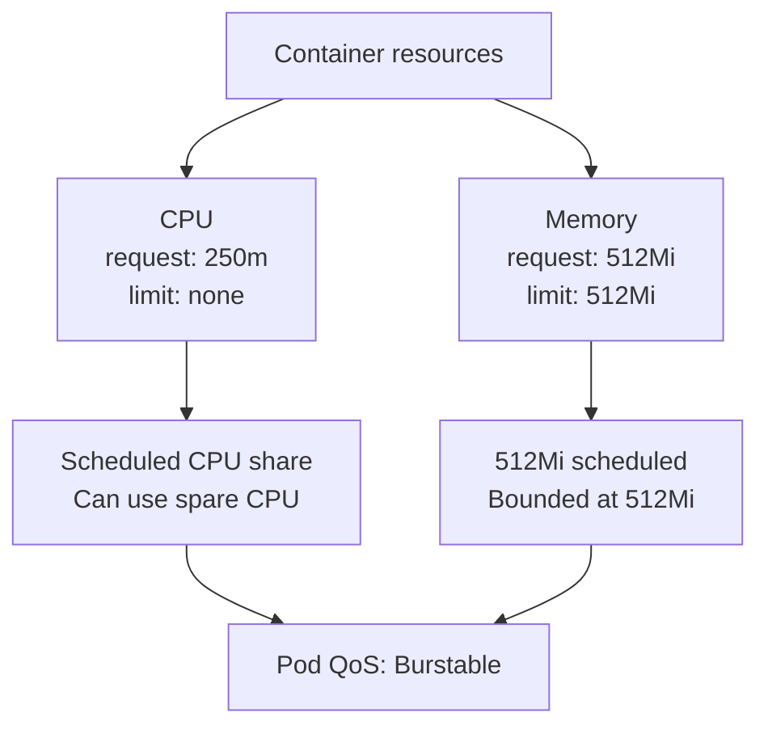

## Resource Management

Resource settings are both a scheduling contract and a runtime safety
boundary. Kubernetes schedules a Pod from its resource **requests**, while the
kubelet and container runtime enforce its resource **limits**. Correct values
help the scheduler place Pods safely, keep one workload from affecting its
neighbours, and give autoscalers meaningful data.

CPU and memory need different treatment:

* CPU is compressible. Under contention, a container receives CPU time in
  proportion to its request; without contention, it can use spare CPU. A CPU
  limit is a hard ceiling and can throttle an otherwise healthy application.
* Memory is not compressible. A memory request informs scheduling, while a
  memory limit protects the node and neighbouring workloads. A container that
  reaches its memory limit can be terminated with an out-of-memory (OOM) kill.

See [Resource Management for Pods and
Containers](https://kubernetes.io/docs/concepts/configuration/manage-resources-containers/)
for the complete Kubernetes behavior.

### Common Approaches

Teams commonly use one of the following patterns:

* **No requests or limits** results in `BestEffort` QoS. The scheduler
  reserves no CPU or memory, and the Pod is a preferred eviction candidate.
  This is suitable only for disposable workloads.
* **Requests only** results in `Burstable` QoS. The scheduler accounts for the
  workload and it can use spare capacity. Without a memory limit, however, a
  leak can consume all memory available on the node.
* **Requests lower than limits** results in `Burstable` QoS and allows
  controlled bursts. CPU can be throttled at its limit, and memory above the
  request is more exposed during node pressure.
* **Requests equal limits for CPU and memory** results in `Guaranteed` QoS. It
  reserves the full declared capacity and reduces eviction risk, but prevents
  CPU bursting and can lower cluster utilization.
* **A CPU request without a CPU limit, plus an equal memory request and
  limit**, results in `Burstable` QoS. It preserves CPU bursting while
  reserving and bounding memory. This is the recommended baseline for general
  workloads.

`Guaranteed` is useful when a workload needs a fixed CPU ceiling or must be
eligible for exclusive CPU allocation under a configured CPU Manager policy.
It should not be the automatic target for every production Pod.

### Recommended Baseline

{}
For every application container, sidecar, and init container:

* set a realistic CPU request;
* do not set a CPU limit; and
* set a memory request and memory limit to the same value.
{}

For example:

```yaml
spec:
  containers:
    - name: api
      image: registry.example.com/api:1.0.0
      resources:
        requests:
          cpu: 250m
          memory: 512Mi
        limits:
          memory: 512Mi
```

The baseline can be visualized as two independent resource decisions that
produce one Pod QoS class:



This gives the scheduler an honest view of the CPU needed under contention and
the maximum memory the container can consume. It also lets the container use
idle CPU above `250m` without being throttled by an artificial ceiling.

Declare the memory request explicitly. If a limit is present without a request
and no admission mechanism supplies a default, Kubernetes copies the limit to
the request. Relying on that default makes the intended scheduling contract
less obvious to readers and policy tools.

Treat a different memory request and limit as a deliberate overcommit policy,
not as a default. It can improve density, but a container using more memory
than its request is more vulnerable to eviction when its node is under memory
pressure.

### Size the Values Step by Step

1. **Measure representative usage.** Include normal traffic, startup,
   background work, and known peak periods. For a new workload, begin with a
   conservative estimate and revise it after collecting metrics.
2. **Choose the CPU request.** Set it to the CPU share the container needs to
   make reliable progress during contention. Avoid both a token request that
   overstates available cluster capacity and an oversized request that leaves
   nodes unnecessarily unschedulable. CPU-based Horizontal Pod Autoscaling
   also depends on an accurate CPU request.
3. **Choose the memory boundary.** Use the observed high-water mark plus enough
   headroom for normal variation. Set both the memory request and limit to this
   value. A repeatedly `OOMKilled` container needs investigation and usually a
   corrected value; increasing the limit blindly can hide a memory leak.
4. **Cover the whole Pod.** Size application containers, sidecars, and init
   containers. One unconfigured container changes the Pod's effective resource
   behavior and can undermine the policy.
5. **Observe and revise.** Check utilization, OOM events, pending Pods, and
   application latency after deployment. Revisit values when the workload or
   traffic profile changes. A Vertical Pod Autoscaler in recommendation mode
   can provide useful starting data without changing Pods automatically.

### QoS Classes

Kubernetes derives a Pod's [Quality of Service (QoS)
class](https://kubernetes.io/docs/concepts/workloads/pods/pod-qos/) from the CPU
and memory requests and limits of its containers:

* `Guaranteed`: every container has equal, non-zero CPU and memory requests
  and limits. These Pods are most protected from node-pressure eviction, but
  cannot use CPU above their limits.
* `Burstable`: at least one CPU or memory request or limit is set, but the Pod
  does not meet the `Guaranteed` criteria. The Pod has a scheduled resource
  share and can burst where a limit is absent.
* `BestEffort`: no container has a CPU or memory request or limit. The
  scheduler makes no reservation, and this is the first QoS class considered
  during resource-pressure eviction.

The recommended baseline intentionally produces `Burstable` Pods because the
CPU limit is absent. Do not add a CPU limit merely to obtain the `Guaranteed`
label. QoS is a consequence of the desired runtime behavior, not a goal by
itself.

During node-pressure eviction, QoS is only a useful summary. The kubelet ranks
Pods based on whether usage exceeds requests, Pod priority, and usage relative
to requests. Keeping the memory request equal to the memory limit therefore
makes the reservation explicit and prevents normal memory use from exceeding
the declared request.

Capsule can [allow, deny, or audit QoS
classes](/docs/rules/enforcement/workloads/#qos-classes). A good tenant baseline
is to reject `BestEffort` Pods and permit the intentional `Burstable` pattern
described above.

### PriorityClasses

QoS describes how resources are declared. A
[PriorityClass](https://kubernetes.io/docs/concepts/scheduling-eviction/pod-priority-preemption/)
describes how important one Pod is relative to another. These mechanisms are
independent: a `Burstable` Pod can have a higher priority than a `Guaranteed`
Pod.

A PriorityClass is cluster-scoped and maps a name to an integer. Higher-priority
Pods are considered earlier in the scheduling queue. By default, a pending
higher-priority Pod can also preempt lower-priority Pods when that would make it
schedulable. The kubelet also considers priority during node-pressure eviction.
Priority does not reserve capacity and does not give a running container more
CPU time; requests and limits still define that behavior.

Define a small set of classes with clear purposes. For example, a standard
tenant class can be non-preempting:

```yaml
apiVersion: scheduling.k8s.io/v1
kind: PriorityClass
metadata:
  name: tenant-standard
value: 1000
preemptionPolicy: Never
globalDefault: false
description: "Default priority for tenant application workloads"
```

Workload owners select an approved class on the Pod template:

```yaml
spec:
  template:
    spec:
      priorityClassName: tenant-standard
      containers:
        - name: api
          # ...
```

Use elevated, preempting classes only for workloads whose unavailability would
prevent the platform or other applications from recovering. Do not use them to
compensate for undersized requests or insufficient cluster capacity. In a
multi-tenant cluster, restrict which PriorityClasses each tenant may select;
otherwise a tenant could displace another tenant's Pods. Capsule can [allow
classes and assign a tenant
default](/docs/tenants/enforcement/#priorityclasses), and Kubernetes
`ResourceQuota` can limit consumption by PriorityClass.

### Platform Guardrails

Application owners should size their workloads, while the platform supplies
safe fallbacks and validation:

* Use [Capsule workload resource
  rules](/docs/rules/enforcement/workloads/#resource-requests-and-limits) to
  remove CPU limits, default requests, and keep memory limits aligned with
  memory requests.
* Use a `LimitRange` for simple namespace defaults and minimum or maximum
  values. Do not configure a default CPU limit, because that would reverse the
  recommended policy.
* Use `ResourceQuota`, [Global Resource
  Quotas](/docs/resource-management/globalresourcequota/), or [Resource
  Pools](/docs/resource-management/resourcepools/) to control aggregate tenant
  consumption. Quotas are capacity boundaries; they do not replace accurate
  per-container sizing.
* Monitor for missing requests, CPU throttling, OOM kills, and sustained usage
  close to the configured boundaries. Defaults should be a temporary safety
  net, not permanent sizing by accident.

Before deploying a workload, verify that every container has a CPU request, no
CPU limit, and equal memory request and limit; that the expected QoS class is
`Burstable`; and that any selected PriorityClass is approved for the tenant.

## Overprovisioning and Overcommit

The terms _overprovisioning_ and _overcommit_ are sometimes used
interchangeably, although they describe different capacity strategies:

* **Workload overcommit** lets declared or potential workload demand exceed
  immediately available capacity. It improves utilization when workloads do
  not peak together, but creates contention when they do.
* **Cluster overprovisioning** keeps deliberate spare capacity available. It
  costs more, but lets new replicas schedule while an autoscaler adds nodes or
  while the platform recovers from a failure.

The right approach depends on the resource. CPU contention delays work; memory
contention can terminate Pods. They should therefore have different defaults.

### CPU Overcommit

Kubernetes places Pods according to CPU requests, so the total CPU requests on
a node normally cannot exceed its allocatable CPU. With no CPU limits,
however, the potential CPU demand of the running workloads can be much higher
than the node's capacity. This is intentional CPU overcommit: containers can
use otherwise idle CPU, and their requests determine their relative share when
several containers need CPU at the same time.

The recommended baseline supports CPU overcommit safely when requests remain
honest. Do not lower requests merely to fit more Pods onto a node. An
undersized request makes scheduling and capacity reports misleading, reduces
the workload's CPU share during contention, and distorts CPU-utilization-based
Horizontal Pod Autoscaling.

There is no universal safe CPU overcommit ratio. Choose it from workload
measurements and service objectives, and account for correlated events such as
traffic peaks, rollouts, batch schedules, and node failures. Watch for:

* sustained node CPU saturation and growing run queues;
* application latency or processing backlogs;
* Horizontal Pod Autoscalers remaining at their maximum replica count; and
* pending Pods when node capacity or autoscaler limits are exhausted.

### Memory Overcommit

Memory is overcommitted when the sum of memory requests fits on a node but the
workloads can collectively use more memory than the node provides. A common
way to create this condition is to set memory requests lower than memory
limits. The scheduler considers the lower requests, while each container can
grow toward its higher limit.

Our baseline avoids memory overcommit by setting each memory request equal to
its limit. This reserves the complete permitted working set and gives the
platform predictable memory accounting.

Use memory overcommit only as an explicit exception for workloads that are
well understood, restart-tolerant, and unlikely to peak together. Keep a hard
memory limit, retain node headroom, and expect increased eviction risk whenever
usage exceeds the request. Avoid memory overcommit for critical or stateful
workloads, uncertain memory profiles, and applications with expensive
recovery.

Monitor the exception using both scheduling and runtime signals:

* memory requests compared with node allocatable memory;
* memory limits compared with node capacity;
* working-set usage compared with requests and limits; and
* node memory pressure, evictions, and container OOM kills.

### Cluster Headroom

Even well-sized workloads need room for failover, rolling updates, sudden
scale-outs, and the delay before new nodes become ready. Define the required
headroom from those recovery objectives rather than relying on capacity that
happens to be idle.

Headroom can be provided by keeping additional nodes running or, when using
Cluster Autoscaler, by scheduling low-priority placeholder Pods with resource
requests. Real workloads preempt the placeholders and use the reserved space
immediately. The displaced placeholder Pods become pending and can trigger a
replacement node. The [Cluster Autoscaler overprovisioning
guide](https://github.com/kubernetes/autoscaler/blob/master/cluster-autoscaler/FAQ.md#how-can-i-configure-overprovisioning-with-cluster-autoscaler)
describes this pattern.

Placeholder Pods must use a dedicated, very low PriorityClass and contain no
application state. Test the interaction between preemption, Pod disruption,
autoscaler priority cutoffs, and scale-down before using the pattern in
production. A PriorityClass only decides which Pods give way; it does not
create capacity by itself.

### Recommended Strategy

{}

* Overcommit CPU through accurate requests and no CPU limits.
* Do not overcommit memory by default; keep memory request equal to limit.
* Maintain explicit cluster headroom for failover and node scale-up time.
* Use quotas to bound tenant reservations and autoscaling to add capacity.
* Treat higher memory overcommit or priority-based reservations as measured,
  monitored exceptions.
{}

Review reservation ratios separately for each node pool and tenant. Aggregate
cluster averages can hide a saturated pool or a single noisy tenant. Revisit
the ratios after workload growth, node-type changes, autoscaler changes, or a
capacity-related incident.

## User Namespaces

{}
The FeatureGate `UserNamespacesSupport` is active by default since [Kubernetes 1.33](https://kubernetes.io/blog/2025/04/25/userns-enabled-by-default/). However every pod must still [opt-in](#admission)

When you are also enabling the FeatureGate `UserNamespacesPodSecurityStandards` you may relax the Pod Security Standards for your workloads. [Read More](https://kubernetes.io/docs/concepts/workloads/pods/user-namespaces/#integration-with-pod-security-admission-checks)
{}

A process running as root in a container can run as a different (non-root) user in the host; in other words, the process has full privileges for operations inside the user namespace, but is unprivileged for operations outside the namespace. [Read More](https://kubernetes.io/docs/concepts/workloads/pods/user-namespaces/)

### Kubelet

On your Kubelet you must use the [FeatureGates](https://kubernetes.io/docs/reference/command-line-tools-reference/feature-gates/):

* `UserNamespacesSupport`
* `UserNamespacesPodSecurityStandards` (Optional)

### Sysctls

```yaml
user.max_user_namespaces: "11255"
```

### Admission (Kyverno)

To make sure all the workloads are forced to use dedicated User Namespaces, we recommend to mutate pods at admission. See the following examples.

#### Kyverno

```yaml
apiVersion: kyverno.io/v1
kind: ClusterPolicy
metadata:
  name: add-hostusers-spec
  annotations:
    policies.kyverno.io/title: Add HostUsers
    policies.kyverno.io/category: Security
    policies.kyverno.io/subject: Pod,User Namespace
    kyverno.io/kubernetes-version: "1.31"
    policies.kyverno.io/description: >-
      Do not use the host's user namespace. A new userns is created for the pod.
      Setting false is useful for mitigating container breakout vulnerabilities even allowing users to run their containers as root
      without actually having root privileges on the host. This field is
      alpha-level and is only honored by servers that enable the
      UserNamespacesSupport feature.
spec:
  rules:
  - name: add-host-users
    match:
      any:
      - resources:
          kinds:
          - Pod
          namespaceSelector:
            matchExpressions:
            - key: capsule.clastix.io/tenant
              operator: Exists
    preconditions:
      all:
      - key: "{{request.operation || 'BACKGROUND'}}"
        operator: AnyIn
        value:
          - CREATE
          - UPDATE
    mutate:
      patchStrategicMerge:
        spec:
          hostUsers: false
```

## Pod Security Standards

In Kubernetes, by default, workloads run with administrative access, which might be acceptable if there is only a single application running in the cluster or a single user accessing it. This is seldom required and you’ll consequently suffer a noisy neighbour effect along with large security blast radiuses.

Many of these concerns were addressed initially by [PodSecurityPolicies](https://kubernetes.io/docs/concepts/security/pod-security-policy) which have been present in the Kubernetes APIs since the very early days.

The Pod Security Policies are deprecated in Kubernetes 1.21 and removed entirely in 1.25. As replacement, the [Pod Security Standards](https://kubernetes.io/docs/concepts/security/pod-security-standards/) and [Pod Security Admission](https://kubernetes.io/docs/concepts/security/pod-security-admission/) has been introduced. Capsule supports the new standard for tenants under its control as well as the oldest approach.


One of the issues with Pod Security Policies is that it is difficult to apply restrictive permissions on a granular level, increasing security risk. Also the Pod Security Policies get applied when the request is submitted and there is no way of applying them to pods that are already running. For these, and other reasons, the Kubernetes community decided to deprecate the Pod Security Policies.

As the Pod Security Policies get deprecated and removed, the [Pod Security Standards](https://kubernetes.io/docs/concepts/security/pod-security-standards/) is used in place. It defines three different policies to broadly cover the security spectrum. These policies are cumulative and range from highly-permissive to highly-restrictive:

- **Privileged**: unrestricted policy, providing the widest possible level of permissions.
- **Baseline**: minimally restrictive policy which prevents known privilege escalations.
- **Restricted**: heavily restricted policy, following current Pod hardening best practices.

Kubernetes provides a built-in [Admission Controller](https://kubernetes.io/docs/reference/access-authn-authz/admission-controllers/#podsecurity) to enforce the Pod Security Standards at either:

1. cluster level which applies a standard configuration to all namespaces in a cluster
2. namespace level, one namespace at a time

For the first case, the cluster admin has to configure the Admission Controller and pass the configuration to the `kube-apiserver` by mean of the `--admission-control-config-file` extra argument, for example:

```yaml
apiVersion: apiserver.config.k8s.io/v1
kind: AdmissionConfiguration
plugins:
- name: PodSecurity
  configuration:
    apiVersion: pod-security.admission.config.k8s.io/v1beta1
    kind: PodSecurityConfiguration
    defaults:
      enforce: "baseline"
      enforce-version: "latest"
      warn: "restricted"
      warn-version: "latest"
      audit: "restricted"
      audit-version: "latest"
    exemptions:
      usernames: []
      runtimeClasses: []
      namespaces: [kube-system]
```

For the second case, he can just assign labels to the specific namespace he wants enforce the policy since the Pod Security Admission Controller is enabled by default starting from Kubernetes 1.23+:

```yaml
apiVersion: v1
kind: Namespace
metadata:
  labels:
    pod-security.kubernetes.io/enforce: baseline
    pod-security.kubernetes.io/warn: restricted
    pod-security.kubernetes.io/audit: restricted
  name: development
```

### Capsule

According to the regular Kubernetes segregation model, the cluster admin has to operate either at cluster level or at namespace level. Since Capsule introduces a further segregation level (the _Tenant_ abstraction), the cluster admin can implement Pod Security Standards at tenant level by simply forcing specific labels on all the namespaces created in the tenant.

You can distribute these profiles via namespace. Here's how this could look like:

```yaml
apiVersion: capsule.clastix.io/v1beta2
kind: Tenant
metadata:
  name: solar
spec:
  namespaceOptions:
    additionalMetadataList:
    - namespaceSelector:
        matchExpressions:
          - key: projectcapsule.dev/low_security_profile
            operator: NotIn
            values: ["system"]
      labels:
        pod-security.kubernetes.io/enforce: restricted
        pod-security.kubernetes.io/warn: restricted
        pod-security.kubernetes.io/audit: restricted
    - namespaceSelector:
        matchExpressions:
          - key: company.com/env
            operator: In
            values: ["system"]
      labels:
        pod-security.kubernetes.io/enforce: privileged
        pod-security.kubernetes.io/warn: privileged
        pod-security.kubernetes.io/audit: privileged

```

All namespaces created by the tenant owner, will inherit the Pod Security labels:

```yaml
apiVersion: v1
kind: Namespace
metadata:
  labels:
    capsule.clastix.io/tenant: solar
    kubernetes.io/metadata.name: solar-development
    name: solar-development
    pod-security.kubernetes.io/enforce: baseline
    pod-security.kubernetes.io/warn: restricted
    pod-security.kubernetes.io/audit: restricted
  name: solar-development
  ownerReferences:
  - apiVersion: capsule.clastix.io/v1beta2
    blockOwnerDeletion: true
    controller: true
    kind: Tenant
    name: solar
```

and the regular Pod Security Admission Controller does the magic:

```yaml
kubectl --kubeconfig alice-wind.kubeconfig apply -f - << EOF
apiVersion: v1
kind: Pod
metadata:
  name: nginx
  namespace: solar-production
spec:
  containers:
  - image: nginx
    name: nginx
    ports:
    - containerPort: 80
    securityContext:
      privileged: true
EOF
```

The request gets denied:

```
Error from server (Forbidden): error when creating "STDIN":
pods "nginx" is forbidden: violates PodSecurity "baseline:latest": privileged
(container "nginx" must not set securityContext.privileged=true)
```

If the tenant owner tries to change or delete the above labels, Capsule will reconcile them to the original tenant manifest set by the cluster admin.

As additional security measure, the cluster admin can also prevent the tenant owner to make an improper usage of the above labels:

```
kubectl annotate tenant solar \
  capsule.clastix.io/forbidden-namespace-labels-regexp="pod-security.kubernetes.io\/(enforce|warn|audit)"
```

In that case, the tenant owner gets denied if she tries to use the labels:

```
kubectl --kubeconfig alice-solar.kubeconfig label ns solar-production \
    pod-security.kubernetes.io/enforce=restricted \
    --overwrite

Error from server (Label pod-security.kubernetes.io/audit is forbidden for namespaces in the current Tenant ...
```

## Pod Security Policies

As stated in the documentation, *"PodSecurityPolicies enable fine-grained authorization of pod creation and updates. A Pod Security Policy is a cluster-level resource that controls security sensitive aspects of the pod specification. The `PodSecurityPolicy` objects define a set of conditions that a pod must run with in order to be accepted into the system, as well as defaults for the related fields."*

Using the [Pod Security Policies](https://kubernetes.io/docs/concepts/security/pod-security-policy), the cluster admin can impose limits on pod creation, for example the types of volume that can be consumed, the linux user that the process runs as in order to avoid running things as root, and more. From multi-tenancy point of view, the cluster admin has to control how users run pods in their tenants with a different level of permission on tenant basis.

Assume the Kubernetes cluster has been configured with [Pod Security Policy Admission Controller](https://kubernetes.io/docs/reference/access-authn-authz/admission-controllers/#podsecuritypolicy) enabled in the APIs server: `--enable-admission-plugins=PodSecurityPolicy`

The cluster admin creates a `PodSecurityPolicy`:

```yaml
apiVersion: policy/v1beta1
kind: PodSecurityPolicy
metadata:
  name: psp:restricted
spec:
  privileged: false
  # Required to prevent escalations to root.
  allowPrivilegeEscalation: false
```

Then create a _ClusterRole_ using or granting the said item

```yaml
kind: ClusterRole
apiVersion: rbac.authorization.k8s.io/v1
metadata:
  name: psp:restricted
rules:
- apiGroups: ['policy']
  resources: ['podsecuritypolicies']
  resourceNames: ['psp:restricted']
  verbs: ['use']
```

He can assign this role to all namespaces in a tenant by setting the tenant manifest:

```yaml
apiVersion: capsule.clastix.io/v1beta2
kind: Tenant
metadata:
  name: solar
spec:
  owners:
  - name: alice
    kind: User
  additionalRoleBindings:
  - clusterRoleName: psp:privileged
    subjects:
    - kind: "Group"
      apiGroup: "rbac.authorization.k8s.io"
      name: "system:authenticated"
```

With the given specification, Capsule will ensure that all tenant namespaces will contain a _RoleBinding_ for the specified _Cluster Role_:

```yaml
kind: RoleBinding
apiVersion: rbac.authorization.k8s.io/v1
metadata:
  name: 'capsule-solar-psp:privileged'
  namespace: solar-production
  labels:
    capsule.clastix.io/tenant: solar
subjects:
  - kind: Group
    apiGroup: rbac.authorization.k8s.io
    name: 'system:authenticated'
roleRef:
  apiGroup: rbac.authorization.k8s.io
  kind: ClusterRole
  name: 'psp:privileged'
```

Capsule admission controller forbids the tenant owner to run privileged pods in `solar-production` namespace and perform privilege escalation as declared by the above Cluster Role `psp:privileged`.

As tenant owner, creates a namespace:

```
kubectl --kubeconfig alice-solar.kubeconfig create ns solar-production
```

and create a pod with privileged permissions:

```yaml
kubectl --kubeconfig alice-solar.kubeconfig apply -f - << EOF
apiVersion: v1
kind: Pod
metadata:
  name: nginx
  namespace: solar-production
spec:
  containers:
  - image: nginx
    name: nginx
    ports:
    - containerPort: 80
    securityContext:
      privileged: true
EOF
```

Since the assigned `PodSecurityPolicy` explicitly disallows privileged containers, the tenant owner will see her request to be rejected by the Pod Security Policy Admission Controller.
