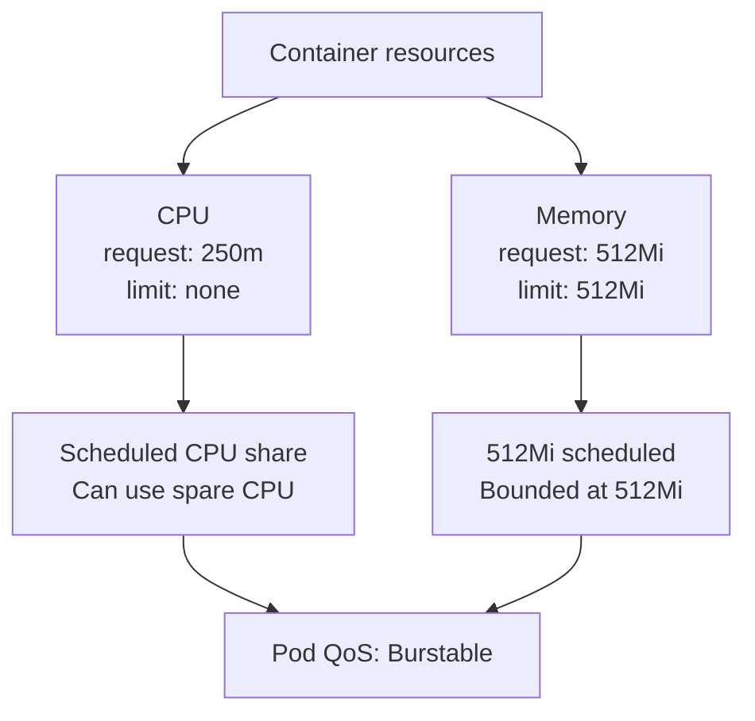

Use namespace rules to establish workload defaults and validate the resulting
Pods. Every Capsule policy example below is a complete Tenant manifest with an
owner and `spec.rules`. Replace `solar` and `solar-owner` with your Tenant name
and owner identity. Each example is an independent configuration; to adopt
multiple policies, combine their `spec.rules` entries into one Tenant manifest.
Namespace selectors can give different namespaces different profiles; keep the
labels selecting mandatory profiles under platform control.

See the [combined Tenant baseline](/docs/operating/best-practices/tenants/#reference)
for these policies together with the networking restrictions.

## Resource Management

Resource settings are both a scheduling contract and a runtime safety
boundary. Kubernetes schedules a Pod from its resource **requests**, while the
kubelet and container runtime enforce its resource **limits**. Correct values
help the scheduler place Pods safely, keep one workload from affecting its
neighbours, and give autoscalers meaningful data.

CPU and memory need different treatment:

* CPU is compressible. Under contention, a container receives CPU time in
  proportion to its request; without contention, it can use spare CPU. A CPU
  limit is a hard ceiling and can throttle an otherwise healthy application.
* Memory is not compressible. A memory request informs scheduling, while a
  memory limit protects the node and neighbouring workloads. A container that
  reaches its memory limit can be terminated with an out-of-memory (OOM) kill.

See [Resource Management for Pods and
Containers](https://kubernetes.io/docs/concepts/configuration/manage-resources-containers/)
for the complete Kubernetes behavior.

### Common Approaches

Teams commonly use one of the following patterns:

* **No requests or limits** results in `BestEffort` QoS. The scheduler
  reserves no CPU or memory, and any memory use exceeds its memory request.
  This is suitable only for disposable workloads.
* **Requests only** results in `Burstable` QoS. The scheduler accounts for the
  workload and it can use spare capacity. Without a memory limit, however, a
  leak can consume all memory available on the node.
* **Requests lower than limits** results in `Burstable` QoS and allows
  controlled bursts. CPU can be throttled at its limit, and memory above the
  request is more exposed during node pressure.
* **Requests equal limits for CPU and memory** results in `Guaranteed` QoS. It
  reserves the full declared capacity and reduces memory-pressure exposure,
  but prevents CPU bursting and can lower cluster utilization.
* **A CPU request without a CPU limit, plus an equal memory request and
  limit**, results in `Burstable` QoS. It preserves CPU bursting while
  reserving and bounding memory. This is the recommended baseline for general
  workloads.

A CPU limit can be useful when a workload needs a fixed CPU ceiling. Exclusive
CPU allocation under the [CPU Manager static
policy](https://kubernetes.io/docs/tasks/administer-cluster/cpu-management-policies/#static-policy)
additionally requires eligible `Guaranteed` containers with integer CPU
requests. `Guaranteed` should not be the automatic target for every production
Pod.

### Recommended Baseline

{}
For every application container, sidecar, and init container:

* set a realistic CPU request;
* do not set a CPU limit; and
* set a memory request and memory limit to the same value.
{}

For example:

```yaml
apiVersion: v1
kind: Pod
metadata:
  name: api
spec:
  containers:
    - name: api
      image: registry.example.com/solar/api:1.0.0
      imagePullPolicy: Always
      resources:
        requests:
          cpu: 250m
          memory: 512Mi
        limits:
          memory: 512Mi
```

The baseline can be visualized as two independent resource decisions that
produce one Pod QoS class:


```mermaid
flowchart TB
  workload["Container resources"]
  cpu["CPU<br/>request: 250m<br/>limit: none"]
  memory["Memory<br/>request: 512Mi<br/>limit: 512Mi"]
  cpuResult["Scheduled CPU share<br/>Can use spare CPU"]
  memoryResult["512Mi scheduled<br/>Bounded at 512Mi"]
  qos["Pod QoS: Burstable"]

  workload --> cpu
  workload --> memory
  cpu --> cpuResult
  memory --> memoryResult
  cpuResult --> qos
  memoryResult --> qos
```

This gives the scheduler an honest view of the CPU needed under contention and
the maximum memory the container can consume. It also lets the container use
idle CPU above `250m` without being throttled by an artificial ceiling.

Declare the memory request explicitly. If a limit is present without a request
and no admission mechanism supplies a default, Kubernetes copies the limit to
the request. Relying on that default makes the intended scheduling contract
less obvious to readers and policy tools.

Treat a different memory request and limit as a deliberate overcommit policy,
not as a default. It can improve density, but a container using more memory
than its request is more vulnerable to eviction when its node is under memory
pressure.

Apply this baseline with [workload resource
rules](/docs/rules/enforcement/workloads/#requests-and-limits):

```yaml
apiVersion: capsule.clastix.io/v1beta2
kind: Tenant
metadata:
  name: solar
spec:
  owners:
    - kind: User
      name: solar-owner
  rules:
    - enforce:
        action: deny
        workloads:
          targets: [pod/containers, pod/initcontainers]
          resources:
            requests:
              cpu:
                policy: Default
                value: 250m
              memory:
                policy: Default
                value: 512Mi
            limits:
              cpu:
                policy: Remove
              memory:
                policy: MatchRequest
    # Normalize Pod-level limits too, when a workload supplies Pod resources.
    - enforce:
        action: deny
        workloads:
          targets: [pod]
          resources:
            limits:
              cpu:
                policy: Remove
              memory:
                policy: MatchRequest
```

Replace `solar-owner` with your owner identity and size the defaults for your
workloads. `Default` preserves existing requests, `Remove` deletes CPU limits,
and `MatchRequest` sets memory limits to the corresponding requests. These
resource policies mutate Pod creation before enforcement; ordinary Pod updates
are validated without resource mutation. They also cover controller-created
Pods. Add explicit [controller targets](/docs/rules/enforcement/workloads/#workload-targets)
if you want template validation and resource mutation when controllers are saved.

#### Size the Values Step by Step

1. **Measure representative usage.** Include normal traffic, startup,
   background work, and known peak periods. For a new workload, begin with a
   conservative estimate and revise it after collecting metrics.
2. **Choose the CPU request.** Set it to the CPU share the container needs to
   make reliable progress during contention. Avoid both a token request that
   overstates available cluster capacity and an oversized request that leaves
   nodes unnecessarily unschedulable. CPU-based Horizontal Pod Autoscaling
   also depends on an accurate CPU request.
3. **Choose the memory boundary.** Use the observed high-water mark plus enough
   headroom for normal variation. Set both the memory request and limit to this
   value. A repeatedly `OOMKilled` container needs investigation and usually a
   corrected value; increasing the limit blindly can hide a memory leak.
4. **Cover the whole Pod.** Size application containers, sidecars, and init
   containers. One unconfigured container changes the Pod's effective resource
   behavior and can undermine the policy.
5. **Observe and revise.** Check utilization, OOM events, pending Pods, and
   application latency after deployment. Revisit values when the workload or
   traffic profile changes. A Vertical Pod Autoscaler in recommendation mode
   can provide useful starting data without changing Pods automatically.

### QoS Classes

Kubernetes derives a Pod's [Quality of Service (QoS)
class](https://kubernetes.io/docs/concepts/workloads/pods/pod-qos/) from CPU and
memory settings. With container-level resources:

* `Guaranteed`: every container has equal, non-zero CPU and memory requests
  and limits.
* `Burstable`: some CPU or memory resources are declared, but the Pod does not
  meet the `Guaranteed` criteria.
* `BestEffort`: no CPU or memory requests or limits are declared.

Where supported, Pod-level resources also participate in classification.
Ephemeral-storage requests and limits do not determine QoS.

The recommended baseline intentionally produces `Burstable` Pods because CPU
limits are absent. Equal memory requests and limits make memory reservations
explicit, but a QoS class does not guarantee protection from eviction. See
[Eviction and Capacity Planning](#eviction-and-capacity-planning) for the
resource-specific decisions, including disk pressure.

Capsule can [allow, deny, or audit QoS
classes](/docs/rules/enforcement/workloads/#qos-classes). A good tenant baseline
is to reject `BestEffort` Pods and permit the intentional `Burstable` pattern
described above.

For example, reject `BestEffort` without forcing all workloads into
`Guaranteed`:

```yaml
apiVersion: capsule.clastix.io/v1beta2
kind: Tenant
metadata:
  name: solar
spec:
  owners:
    - kind: User
      name: solar-owner
  rules:
    - enforce:
        action: deny
        workloads:
          targets: [pod]
          qosClasses: [BestEffort]
```

Resource mutations run before this check. When combined with the recommended
resource baseline, its defaults supply requests before QoS is evaluated. This
QoS-only example does not add requests or limits, ensure every container is
sized, or provide a disk or inode reservation.

### PriorityClasses

QoS describes how resources are declared. A
[PriorityClass](https://kubernetes.io/docs/concepts/scheduling-eviction/pod-priority-preemption/)
describes how important one Pod is relative to another. These mechanisms are
independent: a `Burstable` Pod can have a higher priority than a `Guaranteed`
Pod.

A PriorityClass is cluster-scoped and maps a name to an integer. Higher-priority
Pods are considered earlier in the scheduling queue. By default, a pending
higher-priority Pod can also preempt lower-priority Pods when that would make it
schedulable. The kubelet also considers priority during node-pressure eviction.
Priority does not reserve capacity and does not give a running container more
CPU time; requests and limits still define that behavior.

Define a small set of classes with clear purposes. For example, a standard
tenant class can be non-preempting:

```yaml
apiVersion: scheduling.k8s.io/v1
kind: PriorityClass
metadata:
  name: tenant-standard
value: 1000
preemptionPolicy: Never
globalDefault: false
description: "Default priority for tenant application workloads"
```

Workload owners select an approved class on the Pod template:

```yaml
apiVersion: apps/v1
kind: Deployment
metadata:
  name: api
spec:
  replicas: 1
  selector:
    matchLabels:
      app: api
  template:
    metadata:
      labels:
        app: api
    spec:
      priorityClassName: tenant-standard
      containers:
        - name: api
          image: registry.example.com/solar/api:1.0.0
          imagePullPolicy: Always
          resources:
            requests:
              cpu: 250m
              memory: 512Mi
            limits:
              memory: 512Mi
```

Use elevated, preempting classes only for workloads whose unavailability would
prevent the platform or other applications from recovering. Do not use them to
compensate for undersized requests or insufficient cluster capacity. In a
multi-tenant cluster, restrict which PriorityClasses each tenant may select;
otherwise a tenant could displace another tenant's Pods. Capsule can [allow
classes and assign a tenant
default](/docs/tenants/enforcement/#priorityclasses), and Kubernetes
`ResourceQuota` can limit consumption by PriorityClass.

### Platform Guardrails

Application owners should size their workloads, while the platform supplies
safe fallbacks and validation:

* Use [Capsule workload resource
  rules](/docs/rules/enforcement/workloads/#requests-and-limits) to
  remove CPU limits, default requests, and keep memory limits aligned with
  memory requests.
* Use a `LimitRange` for simple namespace defaults and minimum or maximum
  values. Do not configure a default CPU limit, because that would reverse the
  recommended policy.
* Use `ResourceQuota`, [Global Resource
  Quotas](/docs/resource-management/globalresourcequota/), or [Resource
  Pools](/docs/resource-management/resourcepools/) to control aggregate tenant
  consumption. Quotas are capacity boundaries; they do not replace accurate
  per-container sizing.
* Monitor for missing requests, CPU throttling, OOM kills, and sustained usage
  close to the configured boundaries. Defaults should be a temporary safety
  net, not permanent sizing by accident.

Before deploying a workload, verify that every container has a CPU request, no
CPU limit, and equal memory request and limit; that the expected QoS class is
`Burstable`; and that any selected PriorityClass is approved for the tenant.

### Overprovisioning and Overcommit

The terms _overprovisioning_ and _overcommit_ are sometimes used
interchangeably, although they describe different capacity strategies:

* **Workload overcommit** lets declared or potential workload demand exceed
  immediately available capacity. It improves utilization when workloads do
  not peak together, but creates contention when they do.
* **Cluster overprovisioning** keeps deliberate spare capacity available. It
  costs more, but lets new replicas schedule while an autoscaler adds nodes or
  while the platform recovers from a failure.

The right approach depends on the resource. CPU contention delays work; memory
contention can terminate Pods. They should therefore have different defaults.

#### CPU Overcommit

Kubernetes places Pods according to CPU requests, so the total CPU requests on
a node normally cannot exceed its allocatable CPU. With no CPU limits,
however, the potential CPU demand of the running workloads can be much higher
than the node's capacity. This is intentional CPU overcommit: containers can
use otherwise idle CPU, and their requests determine their relative share when
several containers need CPU at the same time.

The recommended baseline supports CPU overcommit safely when requests remain
honest. Do not lower requests merely to fit more Pods onto a node. An
undersized request makes scheduling and capacity reports misleading, reduces
the workload's CPU share during contention, and distorts CPU-utilization-based
Horizontal Pod Autoscaling.

There is no universal safe CPU overcommit ratio. Choose it from workload
measurements and service objectives, and account for correlated events such as
traffic peaks, rollouts, batch schedules, and node failures. Watch for:

* sustained node CPU saturation and growing run queues;
* application latency or processing backlogs;
* Horizontal Pod Autoscalers remaining at their maximum replica count; and
* pending Pods when node capacity or autoscaler limits are exhausted.

#### Memory Overcommit

Memory is overcommitted when the sum of memory requests fits on a node but the
workloads can collectively use more memory than the node provides. A common
way to create this condition is to set memory requests lower than memory
limits. The scheduler considers the lower requests, while each container can
grow toward its higher limit.

Our baseline avoids deliberate application memory overcommit by setting each
memory request equal to its limit. Node services, runtime overhead, and failover
still need their own capacity budget; this setting alone does not prevent node
memory pressure.

Use memory overcommit only as an explicit exception for workloads that are
well understood, restart-tolerant, and unlikely to peak together. Keep a hard
memory limit, retain node headroom, and expect increased eviction risk whenever
usage exceeds the request. Avoid memory overcommit for critical or stateful
workloads, uncertain memory profiles, and applications with expensive
recovery.

Monitor the exception using both scheduling and runtime signals:

* memory requests compared with node allocatable memory;
* memory limits compared with node capacity;
* working-set usage compared with requests and limits; and
* node memory pressure, evictions, and container OOM kills.

For a measured exception, this complete Tenant includes the recommended
baseline followed by a rule selecting only batch namespaces. The last rule
replaces the earlier `MatchRequest` limit policy for regular and init container
memory in namespaces labeled `example.com/capacity-profile: batch`:

```yaml
apiVersion: capsule.clastix.io/v1beta2
kind: Tenant
metadata:
  name: solar
spec:
  owners:
    - kind: User
      name: solar-owner
  rules:
    - enforce:
        action: deny
        workloads:
          targets: [pod/containers, pod/initcontainers]
          resources:
            requests:
              cpu:
                policy: Default
                value: 250m
              memory:
                policy: Default
                value: 512Mi
            limits:
              cpu:
                policy: Remove
              memory:
                policy: MatchRequest
    # Normalize Pod-level limits too, when a workload supplies Pod resources.
    - enforce:
        action: deny
        workloads:
          targets: [pod]
          resources:
            limits:
              cpu:
                policy: Remove
              memory:
                policy: MatchRequest
    # Override container memory limits only in batch namespaces.
    - namespaceSelector:
        matchLabels:
          example.com/capacity-profile: batch
      enforce:
        action: deny
        workloads:
          targets: [pod/containers, pod/initcontainers]
          resources:
            limits:
              memory:
                policy: Ratio
                value: "2"
```

A missing memory limit becomes twice its positive request; an explicit limit
above that ratio is denied. Earlier request defaults and CPU policies remain
in effect. If workloads also use Pod-level memory resources, configure that
limit policy for the intended burst too. A later `Preserve` policy instead
clears earlier management and constraints for that same target, field, and
resource; it does not undo
Kubernetes defaults. See [resource policy ordering](/docs/rules/enforcement/workloads/#rule-order-and-policy-overrides).

#### Cluster Headroom

Even well-sized workloads need room for failover, rolling updates, sudden
scale-outs, and the delay before new nodes become ready. Define the required
headroom from those recovery objectives rather than relying on capacity that
happens to be idle.

Headroom can be provided by keeping additional nodes running or, when using
Cluster Autoscaler, by scheduling low-priority placeholder Pods with resource
requests. Real workloads preempt the placeholders and use the reserved space
immediately. The displaced placeholder Pods become pending and can trigger a
replacement node. The [Cluster Autoscaler overprovisioning
guide](https://github.com/kubernetes/autoscaler/blob/master/cluster-autoscaler/FAQ.md#how-can-i-configure-overprovisioning-with-cluster-autoscaler)
describes this pattern.

Placeholder Pods need a dedicated priority below application Pods, but not below
the autoscaler's expendable-Pod cutoff if they should trigger scale-up. The
application class must permit preemption to displace them: `tenant-standard`
with `preemptionPolicy: Never` above cannot do that. Test the replacement and
scale-down behavior, and keep application state out of placeholders. A
PriorityClass only decides which Pods give way; it does not create capacity
by itself.

#### Recommended Strategy

{}

* Overcommit CPU through accurate requests and no CPU limits.
* Do not overcommit memory by default; keep memory request equal to limit.
* Maintain explicit cluster headroom for failover and node scale-up time.
* Use quotas to bound tenant reservations and autoscaling to add capacity.
* Treat higher memory overcommit or priority-based reservations as measured,
  monitored exceptions.
{}

Review reservation ratios separately for each node pool and tenant. Aggregate
cluster averages can hide a saturated pool or a single noisy tenant. Revisit
the ratios after workload growth, node-type changes, autoscaler changes, or a
capacity-related incident.

### Eviction and Capacity Planning

Plan for the resource that can run out. A CPU/memory QoS class is neither a
capacity reservation for other resources nor a general eviction ranking.

#### Distinguish the failure mechanisms

| Situation | What happens | What to plan |
|---|---|---|
| CPU contention | Work slows; CPU limits can throttle. CPU saturation is not a kubelet node-pressure eviction signal. | Realistic CPU requests, latency targets, and scale-out capacity. |
| Container memory limit or node OOM | The kernel can kill a container; its restart policy determines recovery. This differs from a kubelet evicting the Pod. | Measured memory bounds, system reservations, and investigation of `OOMKilled`. |
| Node memory pressure | Kubelet may evict Pods to reclaim memory. | Memory requests versus actual usage, priorities, and node headroom. |
| Disk space pressure | Kubelet first attempts reclamation and can then evict Pods. CPU/memory QoS is not protection. | Storage requests, logs, writable layers, image caches, and filesystem free space. |
| Inode or PID pressure | Pods can be evicted even with spare memory or disk bytes. Priority matters; these resources have no Pod requests. | File counts, process counts, and per-node limits. |
| Local ephemeral-storage limit exceeded | With storage accounting enabled, the Pod can be evicted even without node-wide disk pressure. | Per-container storage limits and bounded scratch volumes. |

For threshold handling and reclamation, see [node-pressure
eviction](https://kubernetes.io/docs/concepts/scheduling-eviction/node-pressure-eviction/).
CPU and memory limit behavior is described under [resource
management](https://kubernetes.io/docs/concepts/configuration/manage-resources-containers/);
local storage accounting has its own [requirements and
limits](https://kubernetes.io/docs/concepts/storage/ephemeral-storage/).

For a node-wide OOM, Linux process selection also uses kubelet-provided OOM
score adjustments influenced by QoS and memory requests. That is a different
mechanism from pressure-eviction ranking. See the [kubelet OOM
policy](https://github.com/kubernetes/kubernetes/blob/v1.36.0/pkg/kubelet/qos/policy.go).

Scheduler preemption is a separate decision that makes room for a pending
higher-priority Pod; it can happen without node pressure. `preemptionPolicy:
Never` prevents a Pod from preempting others, not from being a victim. See
[priority and preemption](https://kubernetes.io/docs/concepts/scheduling-eviction/pod-priority-preemption/).

A drain normally uses the [Eviction
API](https://kubernetes.io/docs/concepts/scheduling-eviction/api-eviction/), which
checks PodDisruptionBudgets. Kubelet node-pressure eviction does not honor a
PDB; hard thresholds can terminate immediately. A PDB limits some voluntary
disruptions and creates no spare capacity. See [disruption
budgets](https://kubernetes.io/docs/concepts/workloads/pods/disruptions/).

#### Why the pressure signal matters more than QoS

For memory, eviction ranking considers usage above the request first, then
lower Pod priority, then usage minus the request. Disk-byte ranking uses
storage consumption and requests for the affected filesystem, not CPU/memory
QoS. Filesystem layout determines which usage is counted. Inode/PID pressure
cannot compare against a Pod request for those resources. See the
[Kubernetes eviction ordering](https://github.com/kubernetes/kubernetes/blob/v1.36.0/pkg/kubelet/eviction/helpers.go).

Consider two Pods at the same priority on a node using one filesystem for
local Pod storage:

| Pod | CPU/memory QoS | Ephemeral-storage request | Local storage use |
|---|---|---|---|
| A | `Guaranteed` | None | `5Gi` |
| B | `Burstable` | `8Gi` | `4Gi` |

Under disk-byte pressure, A exceeds its storage request while B does not. With
valid usage statistics, A ranks before B despite being `Guaranteed`. Adding CPU
limits to B would not fix the full disk. Monitor the actual filesystem signal;
inode exhaustion is a different case from running out of bytes.

Likewise, under memory pressure, a high-priority Pod using more than its memory
request can rank before a lower-priority Pod still within its request. Pods
within requests can still be evicted if the node cannot recover, for example
when system daemons exceed their reservations.

#### Include local storage in the namespace profile

Requests for `ephemeral-storage` inform scheduling. Limits cover accounted
container logs, writable layers, and disk-backed `emptyDir` usage, with
Pod-level accounting rules. They are not an instantaneous filesystem quota.
Memory-backed `emptyDir` consumes memory instead. Persistent volumes need their
own storage planning. See [local ephemeral
storage](https://kubernetes.io/docs/concepts/storage/ephemeral-storage/) and
[memory-backed volumes](https://kubernetes.io/docs/concepts/configuration/manage-resources-containers/#considerations-for-memory-backed-emptydir-volumes).

For workloads with local scratch data, add measured storage defaults:

```yaml
apiVersion: capsule.clastix.io/v1beta2
kind: Tenant
metadata:
  name: solar
spec:
  owners:
    - kind: User
      name: solar-owner
  rules:
    - enforce:
        action: deny
        workloads:
          targets: [pod/containers, pod/initcontainers]
          resources:
            requests:
              ephemeral-storage:
                policy: Default
                value: 1Gi
            limits:
              ephemeral-storage:
                policy: Default
                value: 2Gi
```

These are fallback values, not maximum allowed sizes: `Default` preserves
explicit settings. Use quota to bound namespace consumption, configure log
rotation, and size image-cache space and inodes separately. Ephemeral-storage
policies cannot target Pod-level `spec.resources`.

#### Capacity planning checklist

* **Start with Node Allocatable.** Budget system and Kubernetes daemons and
  eviction margins before application capacity. Reserve overhead for the
  runtime and platform Pods as well. See [system resource
  reservations](https://kubernetes.io/docs/tasks/administer-cluster/reserve-compute-resources/).
* **Track reservations and usage separately.** Requests determine placement;
  actual peaks determine contention. Keep memory overcommit deliberate, and
  include storage bytes, free inodes, and PID availability in monitoring.
* **Plan per eligible node pool.** Affinity, taints, zones, and volume topology
  can make free capacity elsewhere unusable. For example, three eligible nodes
  with `24Gi` allocatable memory each have only `48Gi` after one fails, before
  failover or rollout demand. `60Gi` of requests would not fit that scenario.
* **Budget recovery time.** Allow for replica failover, rollout surge, image
  pulls, and autoscaler delay. Priority and PDBs cannot compensate for missing
  capacity. Test that replacement Pods fit the surviving topology.
* **Diagnose the actual signal.** Use Pod events/status and node conditions to
  distinguish `Evicted`, `OOMKilled`, and `FailedScheduling`. `kubectl top`
  covers CPU/memory usage; it does not establish disk, inode, or PID headroom.

## Placement Constraints

Use workload mutations to establish scheduling restrictions and enforcement to
reject incompatible requests. The effective namespace profile is applied to
new Pods, including Pods created by workload controllers.

### Disallow Control Planes

Keep control-plane node role labels and taints managed by the platform. For
ordinary tenant applications, add required node affinity that excludes both
the current and legacy control-plane labels:

```yaml
apiVersion: capsule.clastix.io/v1beta2
kind: Tenant
metadata:
  name: solar
spec:
  owners:
    - kind: User
      name: solar-owner
  rules:
    - mutate:
        - action: merge
          workloads:
            placement:
              affinity:
                nodeAffinity:
                  requiredDuringSchedulingIgnoredDuringExecution:
                    nodeSelectorTerms:
                      - matchExpressions:
                          - key: node-role.kubernetes.io/control-plane
                            operator: DoesNotExist
                          - key: node-role.kubernetes.io/master
                            operator: DoesNotExist
      enforce:
        action: allow
        workloads:
          targets: [pod]
          placement:
            schedulers:
              - exact: [default-scheduler]
    - enforce:
        action: deny
        workloads:
          targets: [pod]
          placement:
            tolerations:
              - key:
                  exact:
                    - node-role.kubernetes.io/control-plane
                    - node-role.kubernetes.io/master
              # An empty key with Exists tolerates every taint key.
              - key: {exp: '^$'}
                operators: [Exists]
    - enforce:
        action: deny
        conditions:
          - name: direct-node-assignment
            expression: >-
              request.operation == 'CREATE' && has(object.spec.nodeName) && object.spec.nodeName != ''
        workloads:
          targets: [pod]
```

Affinity `merge` combines the exclusions with existing required constraints;
it does not replace an application's other node restrictions. The scheduler
allow-list keeps this example on the native scheduler. The last rule rejects
Pods created with `nodeName`, which would bypass scheduling, while allowing
normal updates after the scheduler binds a Pod. Tolerations permit scheduling
onto tainted nodes; they do not select nodes or prevent kubelet pressure
evictions. See [taints and
tolerations](https://kubernetes.io/docs/concepts/scheduling-eviction/taint-and-toleration/).

These settings apply to newly admitted Pods, not existing ones. Keep node
label/taint writes and `pods/binding` permissions restricted to platform
components. If you use another approved scheduler or different control-plane
labels, adapt the profile to that setup.

### Workload Types

Reserve DaemonSets for platform-managed agents when application tenants should
not run one Pod on every eligible node:

```yaml
apiVersion: capsule.clastix.io/v1beta2
kind: Tenant
metadata:
  name: solar
spec:
  owners:
    - kind: User
      name: solar-owner
  rules:
    - enforce:
        action: deny
        workloads:
          targets: [daemonset]
```

With no workload properties, targets apply the action to the kind itself.
This rejects DaemonSet creation and main-resource updates in the Tenant's
namespaces; existing objects are not removed. Other kinds are unaffected.
Keep this rule separate from resource or image policies, because adding those
properties changes targets into policy scopes. See
[workload targets](/docs/rules/enforcement/workloads/#workload-targets).

## Security

### User Namespaces

For supported Linux node pools, `mutate[].workloads.security.hostUsers: false`
maps users inside a Pod to
different host IDs. Root inside the container therefore does not become host
root. Enable this only after verifying kernel, runtime, and volume filesystem
support; host namespaces and some volume configurations are incompatible. See
[Kubernetes user namespaces](https://kubernetes.io/docs/concepts/workloads/pods/user-namespaces/).

```yaml
apiVersion: capsule.clastix.io/v1beta2
kind: Tenant
metadata:
  name: solar
spec:
  owners:
    - kind: User
      name: solar-owner
  rules:
    - mutate:
        - action: merge
          workloads:
            security:
              hostUsers: false
```

This sets the value on Pod creation, even if the submitted value was `true`.
It does not change the container's `runAsUser` or migrate existing Pods. Apply
it to namespaces whose workloads and nodes support user namespaces, and use
Pod Security Admission for the remaining security-context requirements.
Capsule does not configure node sysctls or runtime prerequisites.

### Pod Security Standards

Use [Pod Security
Admission](https://kubernetes.io/docs/concepts/security/pod-security-admission/)
to apply the `privileged`, `baseline`, or `restricted` standards. Start new
application profiles at `restricted`; use warning and audit modes to assess
existing workloads before enforcing a stricter profile.

Distribute the namespace labels through [managed metadata
rules](/docs/rules/enforcement/metadata/#managed). Explicitly select `Namespace`;
wildcard kinds do not opt into Namespace metadata management. This example
pins the policy to `v1.36`; choose a policy version supported by your cluster
and review it during upgrades.

```yaml
apiVersion: capsule.clastix.io/v1beta2
kind: Tenant
metadata:
  name: solar
spec:
  owners:
    - kind: User
      name: solar-owner
  rules:
    - enforce:
        action: allow
        metadata:
          - apiGroups: [v1]
            kinds: [Namespace]
            labels:
              pod-security.kubernetes.io/enforce:
                managed: restricted
                required: true
                values:
                  - exact: [restricted]
              pod-security.kubernetes.io/enforce-version:
                managed: v1.36
                required: true
                values:
                  - exact: [v1.36]
              pod-security.kubernetes.io/warn:
                managed: restricted
                required: true
                values:
                  - exact: [restricted]
              pod-security.kubernetes.io/warn-version:
                managed: v1.36
                required: true
                values:
                  - exact: [v1.36]
              pod-security.kubernetes.io/audit:
                managed: restricted
                required: true
                values:
                  - exact: [restricted]
              pod-security.kubernetes.io/audit-version:
                managed: v1.36
                required: true
                values:
                  - exact: [v1.36]
```

Capsule sets managed values during admission and reconciles them on existing
namespaces for this unconditional rule. A user's conflicting label value is
overwritten. Kubernetes then checks admitted Pods against the selected
standard; changing namespace labels does not retroactively evict running Pods.
For different profiles, use namespace selectors whose profile labels are
controlled by the platform. Prefer narrow, reviewed exceptions over allowing
tenants to select `privileged` themselves.

## Container Images

Use an approved registry and immutable image references. When requiring
`imagePullPolicy: Always`, remember that the runtime can still reuse cached
layers; `Always` does not mean downloading every layer again. Private-image
credential verification also depends on the kubelet's
`KubeletEnsureSecretPulledImages` support and verification policy. Review the
[image pull and credential verification
behavior](https://kubernetes.io/docs/concepts/containers/images/#image-pull-policy)
for your Kubernetes version.

For a namespace profile that requires registry checks on each container start:

```yaml
apiVersion: capsule.clastix.io/v1beta2
kind: Tenant
metadata:
  name: solar
spec:
  owners:
    - kind: User
      name: solar-owner
  rules:
    - enforce:
        action: allow
        workloads:
          targets:
            - pod/containers
            - pod/initcontainers
            - pod/ephemeralcontainers
            - pod/volumes
          registries:
            - exp: '^registry\.example\.com/solar/.+$'
              policy: [Always]
```

This permits only references in that registry path with `Always` pull policy;
it validates the submitted policy rather than changing it. Registry allow-listing
is separate from registry authentication and image signing. Budget image-cache
storage and registry availability as part of capacity planning.
