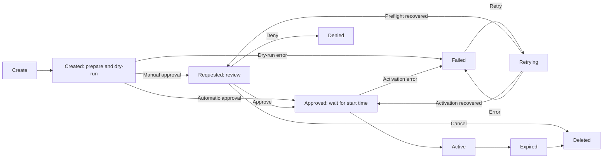

Capsule's Resource Permit API provides approved access to Kubernetes resources.
A user creates a namespaced `ResourcePermit`, Capsule renders the referenced template,
an authorized reviewer or the template's automatic approval policy approves it, and
Capsule manages the resulting resources for the approved lifetime.

Resource Permits can create any discoverable Kubernetes type, including cluster-scoped
objects. Typical uses include temporary `Role` and `RoleBinding` objects for
break-the-glass access, access to a custom resource, or a managed service provisioned
for a tenant. An effective duration gives the permit an expiry time; without one,
it stays active until explicitly expired. Each resource group's deletion policy
determines whether its resources are removed or retained when the permit ends.

## API objects

The feature uses three APIs in `capsule.clastix.io/v1beta2`:

| Kind | Short name | Scope | Purpose |
| --- | --- | --- | --- |
| `ResourcePermit` | `rp` | Namespace | A user's request, parameters, reason, schedule, review, and rendered-resource status |
| `ResourcePermitTemplate` | `rpt` | Namespace | A template available to requests in the same namespace |
| `GlobalResourcePermitTemplate` | `grpt` | Cluster | A reusable template optionally restricted to selected namespaces |

A request explicitly identifies the kind and name of its template:

```yaml
template:
  kind: GlobalResourcePermitTemplate
  name: temporary-widget-editor
```

Admission rejects missing templates, local templates from another namespace, and
global templates that do not select the request namespace. The reference cannot be
changed after the request is created.

## Lifecycle



`Pending` is reserved for a request held by a system workflow. Automatic approval
skips manual review; rendering errors remain visible in `Created`, while dry-run or
activation failures enter the retryable `Failed` phase. The complete paths are shown in
[Resource Permits](./requests/).

When a request becomes active, Capsule uses server-side apply to manage the exact
manifests stored in the request status. On expiry it removes or orphans those
resources according to their policies. A finalizer provides cascading cleanup even
for cluster-scoped targets, for which a namespaced request cannot be an owner.

## Minimal example

The following global template grants a named user read-only Pod access in the
namespace where the request is created. Save it as `template.yaml`.

Use a Capsule build that includes these CRDs and configure
[request and review RBAC](./requests/#operations-and-troubleshooting). The request
namespace must already exist. The template's execution identity needs permission to
manage Roles and RoleBindings there and to grant the listed Pod permissions.

```yaml
apiVersion: capsule.clastix.io/v1beta2
kind: GlobalResourcePermitTemplate
metadata:
  name: temporary-pod-reader
spec:
  defaultDuration: 30m
  maxDuration: 2h
  resources:
    - targets:
        - apiVersion: rbac.authorization.k8s.io/v1
          kind: Role
          metadata:
            name: '{{ .request.name }}-pod-reader'
          rules:
            - apiGroups: [""]
              resources: ["pods", "pods/log"]
              verbs: ["get", "list", "watch"]
        - apiVersion: rbac.authorization.k8s.io/v1
          kind: RoleBinding
          metadata:
            name: '{{ .request.name }}-pod-reader'
          roleRef:
            apiGroup: rbac.authorization.k8s.io
            kind: Role
            name: '{{ .request.name }}-pod-reader'
          subjects:
            - kind: User
              apiGroup: rbac.authorization.k8s.io
              name: '{{ .user }}'
  paramSchema:
    type: object
    required: [user]
    additionalProperties: false
    properties:
      user:
        type: string
        minLength: 1
```

A user can then request the permit. Save this as `request.yaml`:

```yaml
apiVersion: capsule.clastix.io/v1beta2
kind: ResourcePermit
metadata:
  name: investigate-pods
  namespace: solar-uat
spec:
  template:
    kind: GlobalResourcePermitTemplate
    name: temporary-pod-reader
  params:
    user: alice
  reason: Investigate incident INC-1042
  duration: 20m
```

```bash
kubectl apply -f template.yaml
kubectl wait --for=condition=Ready globalresourcepermittemplate/temporary-pod-reader --timeout=60s
kubectl apply -f request.yaml
kubectl wait --for=jsonpath='{.status.phase}'=Requested resourcepermit/investigate-pods -n solar-uat --timeout=60s
kubectl capsule rp review investigate-pods -n solar-uat --approve
kubectl get resourcepermit investigate-pods -n solar-uat
```

Run template installation as a template administrator, request creation as the
requester, and review as an authorized reviewer. Generated Role and RoleBinding names
include the permit name so separate permits can coexist in the same namespace.

Capsule overwrites `spec.requester` with the authenticated user's name and groups;
clients should not rely on supplying that field themselves.

## Security model

The Resource Permit API combines Kubernetes authorization with Capsule admission checks:

- Kubernetes RBAC controls who may create requests or update their status.
- Template approvers and CEL conditions further restrict approval.
- The rendered manifests, reviewer identity, template version and resolved
  ServiceAccount are controller-owned status fields and cannot be forged.
- Managed-resource protection can block direct update and delete operations while
  a request is active.
- Context reads and resource operations use one recorded ServiceAccount identity.
- Form hints never grant access and must list resources with the requesting user's
  credentials.

The template author remains responsible for defining safe parameters, conditions,
resource policies, and RBAC for the execution identity.

## Continue reading

Use [Templates](./templates/) to define inputs, rendering, context, and execution
ServiceAccounts. [Resource Permits](./requests/) covers lifecycle, approval, commands,
and operations. Reusable behavior is documented under concepts:

- [Parameter Schemas and Dynamic Forms](/docs/operating/concepts/parameter-schema/)
- [Managed Resources and Server-Side Apply](/docs/operating/concepts/managed-resources/)
