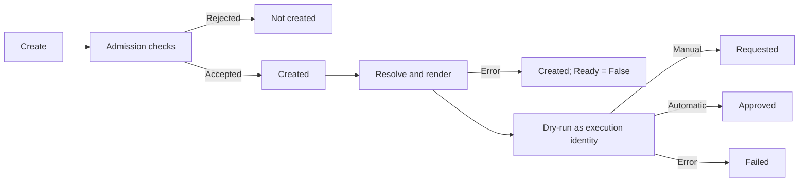
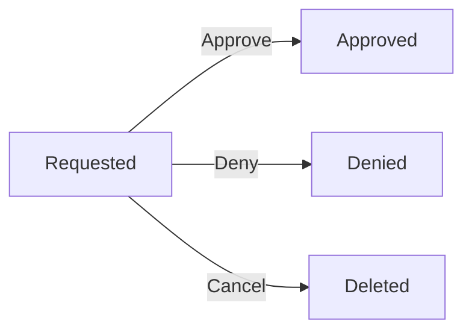
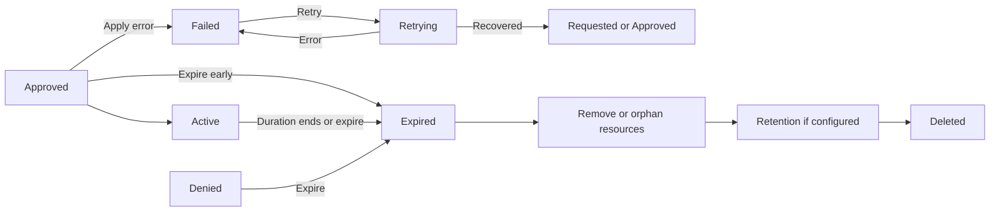

A `ResourcePermit` is namespaced. Its namespace is the authorization boundary for
creating the request and the default destination for namespaced resources rendered by
its template. A request may also create cluster-scoped resources.

## Lifecycle

The normal lifecycle is deliberately small:

| Phase | Meaning |
| --- | --- |
| `Created` | Accepted by admission; Capsule is resolving and rendering the request |
| `Requested` | Ready for manual review |
| `Pending` | Reserved for a system-held request |
| `Denied` | A reviewer denied the request |
| `Approved` | Approved and waiting for activation |
| `Active` | The rendered resources are being managed |
| `Failed` | A resource preflight or activation failed and may be retried |
| `Retrying` | A caller requested another preflight or activation attempt |
| `Expired` | Access ended; cleanup and retention apply |

**Creation**



Admission first verifies that the referenced template exists, is available in the
request namespace, and accepts the parameters, requested duration, start time, and
automatic-approval conditions. Capsule then loads context, resolves the execution
ServiceAccount, and renders the resources. It performs a server-side dry-run with the
resolved execution identity before review. Template lookup, context, or rendering
failures remain in `Created` with `Ready=False`; a dry-run failure enters `Failed`.
Nothing is applied before approval.

**Review**



`Pending` has the same review and cancellation paths, but is reserved for system
workflows. With automatic approval, Capsule moves directly from successful rendering
to `Approved` and records a system reviewer.

**Access and cleanup**



Capsule writes `Active` only after every resource applies successfully. It uses a
finalizer for cleanup because a namespaced request may manage cluster-scoped objects.
The detailed apply, ownership, and cleanup behavior is described in
[Managed Resources and Server-Side Apply](/docs/operating/concepts/managed-resources/).

Normal-user deletion follows the lifecycle:

| Current state | Deletion |
| --- | --- |
| `Created`, `Requested`, or `Pending` | Allowed as cancellation |
| `Denied`, `Approved`, `Active`, `Failed`, or `Retrying` | Expire first |
| `Expired` before `keepUntil` | Wait until retention ends |
| `Expired` without retention, or after `keepUntil` | Allowed |

Configured Capsule administrators may request deletion in any phase. Finalizer cleanup
still runs for resources Capsule is responsible for removing.

## Create and inspect a request

```yaml
apiVersion: capsule.clastix.io/v1beta2
kind: ResourcePermit
metadata:
  name: gateway-editor-incident-1042
  namespace: solar-uat
spec:
  template:
    kind: GlobalResourcePermitTemplate
    name: temporary-crd-editor
  params:
    name: incident-1042-gateway-editor
    crd: httproutes.gateway.networking.k8s.io
  reason: Restore the public API during INC-1042
  duration: 45m
```

`template.kind` must be `ResourcePermitTemplate` or
`GlobalResourcePermitTemplate`. A local template is resolved in the request namespace;
a global template must select that namespace. The reference is immutable.

This request uses the [complete CRD access template](../templates/#complete-crd-access-example).
It grants access to the authenticated requester through `$.request.username`; the
template does not accept a separate `user` parameter.

`params` must satisfy the template schema. `duration` and `startTime` are optional,
and a start time supplied during creation must be in the future. Capsule replaces
`spec.requestor` with the authenticated username and groups, so callers cannot claim a
different identity. See
[Parameter Schemas and Dynamic Forms](/docs/operating/concepts/parameter-schema/) for
JSON Schema, CEL, and Kubernetes-backed form fields.

Before review, Capsule records:

- the template kind, name, and `resourceVersion`;
- the resolved execution ServiceAccount, including the controller ServiceAccount when
  it is the fallback;
- the template approval policy used for this request;
- the effective duration and start time; and
- the concrete rendered manifests and their resource-group policies.

The rendered snapshot in `.status.request.resources` is what reviewers inspect and
what Capsule later applies. Updating the source template does not change an existing
request's resource or approval-policy snapshot.

The following abridged status omits the rendered manifests and processed items:

```yaml
status:
  request:
    template:
      kind: GlobalResourcePermitTemplate
      name: temporary-crd-editor
      resourceVersion: "18422"
    impersonation:
      name: resource-permit-runner
      namespace: capsule-system
    approvals:
      auto: false
      approvers:
        - kind: Group
          name: platform-on-call
    duration: 45m0s
    startTime: "2026-08-31T10:00:00Z"
    resources: []
  phase: Requested
  transitions:
    - type: Created
      timestamp: "2026-08-31T09:58:00Z"
      actor:
        name: alice
        type: User
      reason: CreatedByUser
    - type: Requested
      timestamp: "2026-08-31T09:58:01Z"
      actor:
        name: alice
        type: User
      reason: PendingReview
  conditions:
    - type: Ready
      status: "True"
      reason: Succeeded
      message: rendered resources are ready for review
      observedGeneration: 1
      lastTransitionTime: "2026-08-31T09:58:01Z"
  processedItems: []
  size: 0
```

`status.transitions` is the chronological lifecycle audit trail. Each entry records
the entered state as `type`, its `timestamp`, compact actor identity (`name` and
`type`), reason, and optional message. Group claims are deliberately not duplicated
into transitions; requester groups remain in `spec.requestor.groups`. `conditions`
describe operational state such as `Ready`, rather than lifecycle history.

Inspect the complete snapshot and conditions with:

```bash
kubectl get resourcepermit gateway-editor-incident-1042 -n solar-uat -o yaml
```

If template lookup, context loading, rendering, impersonation, dry-run, or apply
fails, Capsule sets `Ready=False` with a reason and message. Typical reasons are
`TemplateResolutionFailed`, `TemplateContextFailed`, `TemplateRenderingFailed`,
`ImpersonationFailed`, `ResourcesNotReady`, `ResourceDryRunFailed`, and
`ResourceApplyFailed`. A rendering failure remains `Created` and cannot be approved.
A dry-run or activation failure enters `Failed` and records its stage, retry phase,
reason, and message under `.status.failure`.

```bash
kubectl get resourcepermit gateway-editor-incident-1042 -n solar-uat \
  -o jsonpath='{range .status.conditions[*]}{.type}{"="}{.status}{"  "}{.reason}{": "}{.message}{"\n"}{end}'
```

## Review and control a permit

Build the kubectl plugin from the Capsule source tree and put it on `PATH`:

```bash
make kubectl-capsule
export PATH="$PWD/bin:$PATH"
```

`resource-permit`, `resourcepermit`, `rp`, and `permit` are equivalent command names. Review
interactively, or provide a decision directly:

```bash
kubectl capsule rp review gateway-editor-incident-1042 -n solar-uat

kubectl capsule rp review gateway-editor-incident-1042 \
  -n solar-uat --approve \
  --message "Approved for INC-1042" \
  --duration 30m \
  --keep-for 14d

kubectl capsule rp review gateway-editor-incident-1042 \
  -n solar-uat --deny --message "Use the read-only template"
```

The review table shows each concrete manifest as a row and its resource-group policy
in the left column. Reviewers may adjust effective duration, start time, and retention
within the template limits.

For scheduled access, supply a future RFC3339 timestamp through `spec.startTime` or
the review command's `--start-time` flag. Omit it to allow activation after approval.
The CLI's review command accepts permits in `Requested`; system workflows managing
`Pending` permits must use the status API.

Approval rules belong to the referenced template:

```yaml
spec:
  approvals:
    auto: false
    approvers:
      - kind: User
        name: Timmy
      - kind: Group
        name: platform-on-call
    conditions:
      - "request.spec.reason.startsWith('INC-')"
      - "'platform-engineering' in requestor.groups"
```

For manual approval, a non-empty `approvers` list must match the authenticated
reviewer in addition to Kubernetes RBAC. Supported kinds are `User`, `Group`, and
`ServiceAccount`. An empty list permits any RBAC-authorized reviewer. The approver list
restricts approval, not denial.

Conditions form an OR list: at least one must evaluate to `true`; an empty list is
unconditional. The approver check and condition block are ANDed. Expressions can use
the ResourcePermit as `request`, the authenticated requester as `requestor`, and the
authenticated manual reviewer as `reviewer`.

With `auto: true`, `approvers` is ignored and conditions are checked during creation.
A non-matching request is rejected rather than left for manual review. Automatic
approval without conditions is unconditional and should only be used when every
caller who can create the request may safely receive the rendered access.

Clients submit only the desired phase change. Admission reconstructs reviewer identity
and lifecycle fields while preserving the requestor, rendered snapshot, resolved
template version, execution ServiceAccount, and activation timestamps. A denied
request cannot later be approved, and `Expired` is terminal.

Activation normally happens automatically when the approved start time is reached.
Authorized callers can also request activation or end access early:

```bash
kubectl capsule rp activate gateway-editor-incident-1042 -n solar-uat
kubectl capsule rp expire gateway-editor-incident-1042 -n solar-uat
kubectl capsule rp retry gateway-editor-incident-1042 -n solar-uat
```

`retry` is valid only for a `Failed` request. After the underlying ServiceAccount,
RBAC, admission, or target problem is corrected, Capsule repeats the failed preflight
or activation path. The requester may request retry or early expiry when Kubernetes
RBAC permits the status update.

The commands support Kubernetes impersonation:

```bash
kubectl capsule rp review gateway-editor-incident-1042 \
  -n solar-uat --as alice --as-group platform-on-call
```

Repeat `--as-group` for multiple groups. A group cannot be supplied without a user
unless the loaded kubeconfig already impersonates one.

## Operations and troubleshooting

Resource Permits depend on their CRDs, controllers, admission webhooks, and Kubernetes RBAC.
Chart RBAC for creating ResourcePermits is opt-in:

```bash
helm upgrade --install capsule projectcapsule/capsule \
  --namespace capsule-system \
  --set rbac.resourcepermits.create=true \
  --set-string 'rbac.resourcepermits.labels.rbac\.authorization\.k8s\.io/aggregate-to-admin=true'
```

The generated role covers `resourcepermits` and its status subresource. Kubernetes RBAC
still determines the namespaces in which a user may create or review requests.

Keep the mutating and validating webhooks for `resourcepermits`,
`resourcepermittemplates`, and `globalresourcepermittemplates` enabled. The generic
Resource Permit webhook also protects managed resources when a group uses `protect: true`.

```bash
kubectl get validatingwebhookconfigurations,mutatingwebhookconfigurations
kubectl logs -n capsule-system deployment/capsule-controller-manager
```

Common problems can be narrowed down quickly:

| Symptom | Check |
| --- | --- |
| Request creation is forbidden | Enable chart RBAC and bind the user in the request namespace |
| Template reference is rejected | Check kind/name, local namespace, global namespace selection, and observed generation |
| Template is not ready | Inspect its `.status.conditions`; correct static validation errors or global namespace selection failures |
| Request is not ready | Inspect `.status.conditions`, `.status.request`, and processed items |
| Status transition is denied | Use the CLI or a minimal status patch; verify reviewer, CEL, readiness, and duration |
| Request is `Failed` | Inspect `.status.failure`, correct the reported execution problem, then issue `rp retry` or `rp expire` |
| Request deletion is denied | Cancel only `Created`/`Requested`/`Pending`; otherwise expire and wait for retention |
| Managed object cannot be changed | Check whether its resource group uses `protect: true` |

Useful diagnostics:

```bash
kubectl get resourcepermit REQUEST -n NAMESPACE -o json \
  | jq '.status | {phase, request, review, failure, transitions, conditions, processedItems}'
kubectl get events -n NAMESPACE \
  --field-selector involvedObject.kind=ResourcePermit,involvedObject.name=REQUEST
kubectl get globalresourcepermittemplate TEMPLATE -o yaml
kubectl get resourcepermittemplate TEMPLATE -n NAMESPACE -o yaml
kubectl get namespace NAMESPACE --show-labels
```

Configured Capsule administrators may delete ResourcePermits regardless of phase or
retention. This is an emergency escape hatch; cleanup still runs when a finalizer is
present.

A ResourcePermit never keeps its namespace in `Terminating`. Once namespace deletion
starts, Capsule allows the request to be deleted regardless of lifecycle phase or
archive retention, prunes resources covered by the `Remove` deletion policy, and
releases the request finalizer without waiting for `keepUntil`.

Capsule emits lifecycle events when a request becomes `Requested`, `Approved`,
`Denied`, `Active`, or `Expired`. Every transition event carries the actor as labels:

```yaml
event.projectcapsule.dev/actor: alice
event.projectcapsule.dev/actor-kind: User
```

This makes events selectable by actor, for example:

```bash
kubectl get events -n NAMESPACE \
  -l event.projectcapsule.dev/actor=alice,event.projectcapsule.dev/actor-kind=User
```

Kubernetes label values cannot contain characters such as `@` or `:` and have a
63-character limit. Capsule converts such actor names to a stable, label-safe value
with a short hash suffix. The unmodified identity is always available in
`.status.transitions[].actor`. Transition entries remain the durable in-object audit
trail and include `eventTime` after Capsule emits the corresponding event.

For audit purposes, retain the trusted requestor, reason and parameters, request
snapshot, review decision, transitions, conditions, and managed-resource results.
Configure `keepFor` on templates that require an in-cluster audit window after access
ends.

## Metrics

The Capsule metrics endpoint exposes the following gauges:

| Metric | Labels | Meaning |
| --- | --- | --- |
| `capsule_resourcepermit_phase` | `name`, `target_namespace`, `status` | Value `1` for the permit's current lifecycle phase; `status` contains the phase name |
| `capsule_resourcepermittemplate_condition` | `name`, `target_namespace`, `condition` | Template readiness; `condition="Ready"` is `1` when true and `0` otherwise |
| `capsule_globalresourcepermittemplate_condition` | `name`, `condition` | Global template readiness with the same values |

The permit phase gauge removes the previous phase series when the phase changes.
Template gauges describe the `Ready` condition, independently of permit lifecycle
phases. Their series are removed when the template is deleted and restored when
existing templates reconcile after a controller restart. A missing series does not
mean a template is ready.

For example, find failed permits and templates that are not ready:

```promql
capsule_resourcepermit_phase{status="Failed"} == 1
```

```promql
capsule_resourcepermittemplate_condition{condition="Ready"} == 0
```

```promql
capsule_globalresourcepermittemplate_condition{condition="Ready"} == 0
```
