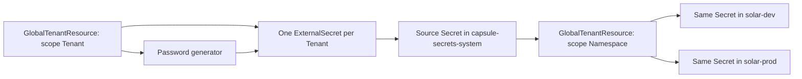

[External Secrets Operator](https://external-secrets.io/latest/) (ESO) fetches credentials from a secret backend or generates them, then writes Kubernetes Secrets. Capsule can provision the ESO resources and distribute the resulting Secrets across a Tenant's namespaces.

This guide covers three patterns:

| Pattern | How it works |
| --- | --- |
| Shared `ClusterSecretStore` | Approved Tenants read credentials intended to be shared, using one backend identity. |
| Dedicated `ClusterSecretStore` per Tenant | Capsule generates a store restricted to that Tenant's namespaces, with a separate backend identity. |
| Generated password per Tenant | ESO creates one source Secret, then Capsule replicates its value into every namespace of that Tenant. |

A namespaced `SecretStore` is usable in its own namespace. A `ClusterSecretStore` is cluster-scoped and can be referenced across namespaces, subject to its conditions. Neither resource contains the application credentials itself: an `ExternalSecret` references the store and describes the target Secret. See ESO's [multi-tenancy guide](https://external-secrets.io/latest/guides/multi-tenancy/).

## Prerequisites

Run the platform setup as a cluster administrator. You need:

* Capsule with [GlobalTenantResource generators](/docs/replications/global/#generators) and `scope: Tenant` support.
* ESO installed with the `external-secrets.io/v1` APIs and the `generators.external-secrets.io/v1alpha1` `Password` API. Its controllers must watch the platform and Tenant namespaces and process `ClusterSecretStore` resources.
* `kubectl`, and Python 3 for the password verification example.
* For the store examples, a reachable Vault server with a KV v2 engine mounted at `secret`, and permission to provision its policies and tokens. Replace `https://vault.example.com` with your endpoint and configure a trusted CA if needed.

The store examples use [Vault](https://external-secrets.io/latest/provider/hashicorp-vault/) to demonstrate backend permissions. The same namespace restrictions apply to other ESO providers, including [Azure Key Vault](https://external-secrets.io/latest/provider/azure-key-vault/). The password-generation example does not require an external backend or a store.

### Example Tenants and namespaces

Save this as `tenants.yaml` and apply it as a cluster administrator. If these Tenants already exist, add the example label to their current manifests while preserving their owners and other configuration.

```yaml
apiVersion: capsule.clastix.io/v1beta2
kind: Tenant
metadata:
  name: solar
  labels:
    secrets.example.com/enabled: "true"
spec:
  owners:
    - kind: Group
      name: solar-engineers
---
apiVersion: capsule.clastix.io/v1beta2
kind: Tenant
metadata:
  name: wind
  labels:
    secrets.example.com/enabled: "true"
spec:
  owners:
    - kind: Group
      name: wind-engineers
---
apiVersion: v1
kind: Namespace
metadata:
  name: solar-dev
  labels:
    capsule.clastix.io/tenant: solar
---
apiVersion: v1
kind: Namespace
metadata:
  name: solar-prod
  labels:
    capsule.clastix.io/tenant: solar
---
apiVersion: v1
kind: Namespace
metadata:
  name: wind-dev
  labels:
    capsule.clastix.io/tenant: wind
```

```bash
kubectl apply -f tenants.yaml
kubectl get namespaces -L capsule.clastix.io/tenant
```

The `secrets.example.com/enabled` label selects Tenants for the GlobalTenantResources below. The `capsule.clastix.io/tenant` namespace label identifies their ownership and is protected by Capsule. Tenant owners normally create namespaces through Capsule's [namespace workflow](/docs/tenants/namespaces/).

### Platform namespace and replication permissions

Keep backend authentication credentials and generated source Secrets in a platform-owned namespace, outside any Tenant. Tenant owners must not have access to this namespace or permission to modify cluster-scoped stores and GlobalTenantResources.

Save this as `eso-provisioner.yaml`:

```yaml
apiVersion: v1
kind: Namespace
metadata:
  name: capsule-secrets-system
---
apiVersion: v1
kind: ServiceAccount
metadata:
  name: capsule-eso
  namespace: capsule-secrets-system
---
apiVersion: rbac.authorization.k8s.io/v1
kind: Role
metadata:
  name: capsule-eso-generators
  namespace: capsule-secrets-system
rules:
  - apiGroups: ["external-secrets.io"]
    resources: ["externalsecrets"]
    verbs: ["get", "list", "create", "patch", "delete"]
  - apiGroups: ["generators.external-secrets.io"]
    resources: ["passwords"]
    verbs: ["get", "list", "create", "patch", "delete"]
---
apiVersion: rbac.authorization.k8s.io/v1
kind: RoleBinding
metadata:
  name: capsule-eso-generators
  namespace: capsule-secrets-system
roleRef:
  apiGroup: rbac.authorization.k8s.io
  kind: Role
  name: capsule-eso-generators
subjects:
  - kind: ServiceAccount
    name: capsule-eso
    namespace: capsule-secrets-system
---
apiVersion: rbac.authorization.k8s.io/v1
kind: ClusterRole
metadata:
  name: capsule-eso-replication
rules:
  - apiGroups: ["external-secrets.io"]
    resources: ["clustersecretstores"]
    verbs: ["get", "list", "create", "patch", "delete"]
  - apiGroups: [""]
    resources: ["secrets"]
    verbs: ["get", "list", "create", "patch", "delete"]
---
apiVersion: rbac.authorization.k8s.io/v1
kind: ClusterRoleBinding
metadata:
  name: capsule-eso-replication
roleRef:
  apiGroup: rbac.authorization.k8s.io
  kind: ClusterRole
  name: capsule-eso-replication
subjects:
  - kind: ServiceAccount
    name: capsule-eso
    namespace: capsule-secrets-system
```

```bash
kubectl apply -f eso-provisioner.yaml
```

The GlobalTenantResources use this ServiceAccount through [Capsule impersonation](/docs/replications/global/#impersonation). The ClusterRole permits Secret replication into current and future Tenant namespaces, which requires broad Secret access; reserve this identity for the platform. ESO uses its own permissions to read authentication credentials, invoke generators, and write source Secrets.

## Secure ClusterSecretStores

A store needs two independent access boundaries:

* **Kubernetes namespace access:** `spec.conditions` determines which namespaces may reference the store.
* **Backend access:** the store's Vault policy, cloud IAM role, or equivalent determines which remote secrets it may fetch.

All users of a store share its backend permissions. A name such as `tenant-solar-vault`, or a tenant-specific `remoteRef.key` in an example, does not restrict users to that path. Someone able to create an `ExternalSecret` can request a different key within the backend identity's permissions.

For an existing platform-only store, keep its provider configuration and restrict its conditions to the platform namespace:

```yaml
spec:
  conditions:
    - namespaces:
        - capsule-secrets-system
```

Alternatively, a namespace selector using `matchExpressions` with key `capsule.clastix.io/tenant` and operator `DoesNotExist` can admit all namespaces outside Capsule Tenants. An explicit namespace allowlist is narrower. With no conditions, a `ClusterSecretStore` is usable from all namespaces. Conditions are alternatives: matching any entry grants access, so remove broader entries when restricting an existing store. See [ClusterSecretStore conditions](https://external-secrets.io/latest/api/clustersecretstore/).

## Use a shared ClusterSecretStore

Use a shared store for credentials that all participating Tenants are allowed to read, such as access to a common package registry. This example admits namespaces belonging to `solar` and `wind`.

Provision a Vault identity with a policy allowing only the shared KV v2 path. For example, save this as `eso-shared.hcl`:

```hcl
path "secret/data/shared/*" {
  capabilities = ["read"]
}
```

The policy uses the [Vault KV v2 read path](https://developer.hashicorp.com/vault/docs/secrets/kv/kv-v2/cookbook/read-data), which includes the `data` segment. An ESO `remoteRef.key` below is relative to the `secret` mount and omits `data`.

Using an authenticated Vault CLI and `jq`, create the policy and store its token directly in Kubernetes:

```bash
set -o pipefail
vault policy write eso-shared eso-shared.hcl
vault token create -policy=eso-shared -format=json \
  | jq -j '.auth.client_token' \
  | kubectl -n capsule-secrets-system create secret generic vault-shared \
      --from-file=token=/dev/stdin
```

Manage the token's expiration, renewal, and rotation as part of your backend setup. ESO also supports [Vault Kubernetes authentication](https://external-secrets.io/latest/provider/hashicorp-vault/#kubernetes-authentication) when you want to use dedicated ServiceAccount identities instead.

Save this as `shared-store.yaml`:

```yaml
apiVersion: external-secrets.io/v1
kind: ClusterSecretStore
metadata:
  name: shared-vault
spec:
  conditions:
    - namespaceSelector:
        matchExpressions:
          - key: capsule.clastix.io/tenant
            operator: In
            values: ["solar", "wind"]
  provider:
    vault:
      server: https://vault.example.com
      path: secret
      version: v2
      auth:
        tokenSecretRef:
          name: vault-shared
          namespace: capsule-secrets-system
          key: token
```

```bash
kubectl apply -f shared-store.yaml
kubectl wait --for=condition=Ready --timeout=120s clustersecretstore/shared-vault
```

Create a Vault record at `secret/shared/registry` with a `password` property using your normal secret-management workflow. A user in an admitted namespace can then apply `shared-credential.yaml`:

```yaml
apiVersion: external-secrets.io/v1
kind: ExternalSecret
metadata:
  name: shared-registry
  namespace: solar-dev
spec:
  refreshPolicy: Periodic
  refreshInterval: 1h
  secretStoreRef:
    kind: ClusterSecretStore
    name: shared-vault
  target:
    name: shared-registry
    creationPolicy: Owner
  data:
    - secretKey: password
      remoteRef:
        key: shared/registry
        property: password
```

```bash
kubectl apply -f shared-credential.yaml
kubectl -n solar-dev wait --for=condition=Ready --timeout=120s externalsecret/shared-registry
```

ESO creates the `shared-registry` Secret in `solar-dev`. Apply the same ExternalSecret in another admitted namespace to fetch that shared credential there as well. A namespace outside `solar` and `wind` cannot use this store, even if its users know the store name.

## Create a dedicated ClusterSecretStore per Tenant

For tenant-specific credentials, give each store a different backend identity. This example generates `tenant-solar-vault` and `tenant-wind-vault`, with names derived from the Capsule Tenant name.

First provision a separate Vault policy and token for each Tenant. Solar's `eso-tenant-solar.hcl` policy is:

```hcl
path "secret/data/tenants/solar/*" {
  capabilities = ["read"]
}
```

```bash
set -o pipefail
vault policy write eso-tenant-solar eso-tenant-solar.hcl
vault token create -policy=eso-tenant-solar -format=json \
  | jq -j '.auth.client_token' \
  | kubectl -n capsule-secrets-system create secret generic vault-tenant-solar \
      --from-file=token=/dev/stdin
```

Repeat for Wind, using `secret/data/tenants/wind/*`, policy `eso-tenant-wind`, and Secret `vault-tenant-wind`. Do not reuse a token that can read both tenants' paths. These Kubernetes authentication Secrets hold a `token` key and remain in the platform namespace. Capsule generates the stores; it does not create Vault policies or tokens.

Save this as `tenant-stores.yaml`:

```yaml
apiVersion: capsule.clastix.io/v1beta2
kind: GlobalTenantResource
metadata:
  name: tenant-secret-stores
spec:
  scope: Tenant
  resyncPeriod: 60s
  serviceAccount:
    name: capsule-eso
    namespace: capsule-secrets-system
  tenantSelector:
    matchLabels:
      secrets.example.com/enabled: "true"
  resources:
    - generators:
        - missingKey: error
          template: |
            apiVersion: external-secrets.io/v1
            kind: ClusterSecretStore
            metadata:
              name: tenant-{{ $.tenant.metadata.name }}-vault
            spec:
              conditions:
                - namespaceSelector:
                    matchLabels:
                      capsule.clastix.io/tenant: {{ $.tenant.metadata.name | quote }}
              provider:
                vault:
                  server: https://vault.example.com
                  path: secret
                  version: v2
                  auth:
                    tokenSecretRef:
                      name: vault-tenant-{{ $.tenant.metadata.name }}
                      namespace: capsule-secrets-system
                      key: token
```

```bash
kubectl apply -f tenant-stores.yaml
kubectl wait --for=condition=Ready --timeout=120s globaltenantresource/tenant-secret-stores
kubectl wait --for=condition=Ready --timeout=120s \
  clustersecretstore/tenant-solar-vault clustersecretstore/tenant-wind-vault
```

`scope: Tenant` creates one cluster-scoped store per Tenant. The store itself has no `metadata.namespace`; its authentication Secret reference must include one. Its namespace selector automatically admits new namespaces owned by that Tenant.

After creating `secret/tenants/solar/application` in Vault with a `password` property, apply `tenant-credential.yaml`:

```yaml
apiVersion: external-secrets.io/v1
kind: ExternalSecret
metadata:
  name: application-credentials
  namespace: solar-dev
spec:
  refreshPolicy: Periodic
  refreshInterval: 1h
  secretStoreRef:
    kind: ClusterSecretStore
    name: tenant-solar-vault
  target:
    name: application-credentials
    creationPolicy: Owner
  data:
    - secretKey: password
      remoteRef:
        key: tenants/solar/application
        property: password
```

```bash
kubectl apply -f tenant-credential.yaml
kubectl -n solar-dev wait --for=condition=Ready --timeout=120s \
  externalsecret/application-credentials
```

Check both boundaries when validating this setup: an ExternalSecret in `wind-dev` referencing `tenant-solar-vault` should be denied by the store's namespace conditions. An ExternalSecret in `solar-dev` using its own store but requesting `tenants/wind/application` should be denied by Vault. Use a separate test resource and target Secret when checking denied requests, and inspect its conditions with `kubectl describe externalsecret`.

## Generate one password and distribute it to every Tenant namespace

An ESO [Password generator](https://external-secrets.io/latest/api/generator/password/) produces a new random value each time it is invoked. Referencing the same generator from several ExternalSecrets produces different passwords. To share one credential throughout a Tenant, generate it in one source Secret and replicate that Secret. The generator resource holds the password-generation settings, not the generated password. See [generator behavior](https://external-secrets.io/latest/guides/generator/).



### Generate the source Secrets

Save this as `tenant-password-sources.yaml`. It creates a Password generator and an ExternalSecret for each enabled Tenant, all in `capsule-secrets-system`:

```yaml
apiVersion: capsule.clastix.io/v1beta2
kind: GlobalTenantResource
metadata:
  name: tenant-password-sources
spec:
  scope: Tenant
  resyncPeriod: 60s
  serviceAccount:
    name: capsule-eso
    namespace: capsule-secrets-system
  tenantSelector:
    matchLabels:
      secrets.example.com/enabled: "true"
  resources:
    - generators:
        - missingKey: error
          template: |
            apiVersion: generators.external-secrets.io/v1alpha1
            kind: Password
            metadata:
              name: tenant-{{ $.tenant.metadata.name }}-password
              namespace: capsule-secrets-system
            spec:
              length: 32
              digits: 6
              symbols: 0
              noUpper: false
              allowRepeat: true
            ---
            apiVersion: external-secrets.io/v1
            kind: ExternalSecret
            metadata:
              name: tenant-{{ $.tenant.metadata.name }}-password
              namespace: capsule-secrets-system
            spec:
              refreshPolicy: CreatedOnce
              target:
                name: tenant-{{ $.tenant.metadata.name }}-password
                creationPolicy: Owner
                template:
                  engineVersion: v2
                  mergePolicy: Merge
                  type: Opaque
                  metadata:
                    labels:
                      secrets.example.com/tenant: {{ $.tenant.metadata.name | quote }}
                      secrets.example.com/purpose: shared-password
              dataFrom:
                - sourceRef:
                    generatorRef:
                      apiVersion: generators.external-secrets.io/v1alpha1
                      kind: Password
                      name: tenant-{{ $.tenant.metadata.name }}-password
```

```bash
kubectl apply -f tenant-password-sources.yaml
kubectl wait --for=condition=Ready --timeout=120s globaltenantresource/tenant-password-sources
kubectl -n capsule-secrets-system wait --for=condition=Ready --timeout=120s \
  externalsecret/tenant-solar-password externalsecret/tenant-wind-password
```

For Solar, ESO creates `capsule-secrets-system/tenant-solar-password` with a `password` data key. Wind gets an independent value in `tenant-wind-password`. A generator reference resolves in the ExternalSecret's namespace and does not need `secretStoreRef`.

`CreatedOnce` avoids scheduled regeneration. Capsule's `resyncPeriod` reconciles the ESO resource definitions; it does not request a new password on every pass. However, [ESO can sync again if the target Secret changes or is deleted, or if the ExternalSecret is recreated](https://external-secrets.io/latest/api/externalsecret/#createdonce). Treat source recreation as credential rotation and retain a backup if the credential must survive recovery.

The explicit `target.template.metadata` is significant: it defines the source Secret's labels instead of inheriting the Capsule management labels from its ExternalSecret. Capsule skips Secrets marked `projectcapsule.dev/created-by: resources` during replication to prevent loops. Keep the source Secret owned by ESO and its replicas owned by Capsule; do not stamp Capsule's reserved labels onto the source. ESO's [template metadata behavior](https://github.com/external-secrets/external-secrets/blob/main/pkg/controllers/externalsecret/externalsecret_controller_template.go) controls this distinction.

### Replicate the source into all namespaces

Save this as `tenant-password-replication.yaml`:

```yaml
apiVersion: capsule.clastix.io/v1beta2
kind: GlobalTenantResource
metadata:
  name: tenant-password-replication
spec:
  scope: Namespace
  resyncPeriod: 60s
  serviceAccount:
    name: capsule-eso
    namespace: capsule-secrets-system
  tenantSelector:
    matchLabels:
      secrets.example.com/enabled: "true"
  resources:
    - namespacedItems:
        - apiVersion: v1
          kind: Secret
          namespace: capsule-secrets-system
          name: "tenant-{{tenant.name}}-password"
          optional: false
```

```bash
kubectl apply -f tenant-password-replication.yaml
kubectl wait --for=condition=Ready --timeout=120s globaltenantresource/tenant-password-replication
```

The [namespaced reference](/docs/replications/global/#namespaceditems) selects one source by name for each Tenant. With `scope: Namespace` and no `namespaceSelector`, Capsule copies it into every namespace of that Tenant, preserving its name and data. New namespaces receive the existing value on reconciliation. `optional: false` reports a missing source instead of silently producing no copies.

Capsule's generator and replication readiness only covers Kubernetes resources. It does not prove that ESO has created the source Secret, which is why the commands wait for the source ExternalSecrets separately. If the two GlobalTenantResources are applied together, replication may initially report a missing Secret and then succeed once ESO creates it.

### Verify identical values and tenant isolation

Check that both Solar namespaces have Solar's Secret and Wind has only its own:

```bash
kubectl -n solar-dev get secret tenant-solar-password
kubectl -n solar-prod get secret tenant-solar-password
kubectl -n wind-dev get secret tenant-wind-password
kubectl -n wind-dev get secret tenant-solar-password
```

The last command should report `NotFound`. This Python check compares the values without printing passwords or hashes:

```python
import base64
import json
import subprocess


def password(namespace, name):
    raw = subprocess.check_output(
        ["kubectl", "-n", namespace, "get", "secret", name, "-o", "json"]
    )
    return base64.b64decode(json.loads(raw)["data"]["password"])


solar = password("capsule-secrets-system", "tenant-solar-password")
wind = password("capsule-secrets-system", "tenant-wind-password")
assert len(solar) == 32
assert solar == password("solar-dev", "tenant-solar-password")
assert solar == password("solar-prod", "tenant-solar-password")
assert wind == password("wind-dev", "tenant-wind-password")
assert solar != wind
print("Passwords match within each Tenant and differ between Tenants.")
```

Create another namespace belonging to Solar and repeat the comparison after replication. The new namespace should receive the same source value; adding a namespace does not invoke the Password generator again.

Workloads consume the local copy through a Secret volume or `secretKeyRef`. For example, use this fragment in a Pod template in `solar-dev` or `solar-prod`:

```yaml
env:
  - name: APPLICATION_PASSWORD
    valueFrom:
      secretKeyRef:
        name: tenant-solar-password
        key: password
```

Register the generated credential with the service that authenticates it. Creating or copying a Secret does not set a database user's password or otherwise configure that service.

## Rotation and lifecycle

For backend-managed values, update the backend record. The `Periodic` ExternalSecrets fetch it on their next refresh. Backend authentication tokens have their own lifecycle and must be renewed or replaced separately.

For generated passwords, `CreatedOnce` keeps the source stable during ordinary reconciliation. Recreating the source can produce a different password, and Capsule will then distribute the new value. Coordinate rotation with the authenticating service and all consuming workloads. Applications using environment variables need a restart to load changed Secret values; applications reading Secret volumes need to reload them.

The example uses `creationPolicy: Owner`, so deleting the source ExternalSecret also makes its source Secret eligible for garbage collection. Removing the Tenant's opt-in label or deleting its GlobalTenantResources can prune generated objects and replicas under Capsule's [object management rules](/docs/replications/global/#object-management). Check that replicas are removed and service credentials are revoked during offboarding. Source removal alone is not immediate credential revocation.

For credentials that must survive deleting and recreating an ExternalSecret, ESO documents [`creationPolicy: Orphan` with an immutable target](https://external-secrets.io/latest/api/externalsecret/#createdonce). That changes cleanup and rotation: retained source Secrets need explicit offboarding, and immutable replicas cannot be updated in place. Choose that lifecycle deliberately rather than adding immutability to the replication example unchanged.
