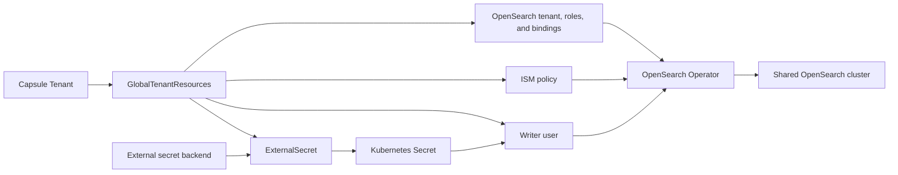

[OpenSearch](https://opensearch.org/) can provide a shared logging service for Capsule Tenants. The [OpenSearch Kubernetes Operator](https://github.com/opensearch-project/opensearch-k8s-operator) manages the cluster and its security resources, while Capsule [GlobalTenantResources](/docs/replications/global/) generate the configuration for each participating Tenant. [External Secrets Operator](/ecosystem/integrations/eso/) supplies passwords from an external secret backend.

This example first installs a shared cluster, then provisions the following resources for a Capsule Tenant named `solar`:

| Resource | Purpose |
| --- | --- |
| `OpensearchTenant` | A Dashboards workspace named `solar`. |
| `OpensearchRole` | Separate permissions for owners, members, viewers, and writers. |
| `OpensearchUserRoleBinding` | Connect the three human access groups and the static writer user to their roles. |
| `OpenSearchISMPolicy` | Delete the Tenant's log indices after 30 days. |
| `ExternalSecret` and `OpensearchUser` | Maintain the `tenant-solar-writer` account using a password stored outside Kubernetes. |

A Capsule Tenant groups Kubernetes namespaces. An [OpenSearch tenant](https://docs.opensearch.org/latest/security/multi-tenancy/tenant-index/) holds Dashboards saved objects, such as visualizations and index patterns. Index access is controlled separately by OpenSearch roles. This guide configures both boundaries.



All generated objects live in `opensearch-system`, a platform-owned namespace outside any Capsule Tenant. Tenant owners must not have Kubernetes write access there: the OpenSearch custom resources can grant access to the shared cluster. `scope: Tenant` renders each set of resources once per enabled Capsule Tenant, regardless of how many namespaces it owns.

## Prerequisites

Run the example as a cluster administrator. You need:

* Capsule with support for `GlobalTenantResource.spec.scope: Tenant`, generators, and `Tenant.spec.data`; see the [installation guide](/docs/operating/setup/installation/) and [templating documentation](/docs/operating/concepts/templating/).
* External Secrets Operator serving `external-secrets.io/v1`, with a working `ClusterSecretStore` named `platform-opensearch` connected to your secret backend.
* A default StorageClass and capacity for three OpenSearch nodes, each requesting 2 GiB of memory and a 20 GiB volume, plus Dashboards.
* Helm, `kubectl`, `curl`, and `jq` locally.

The example pins OpenSearch Operator chart `3.0.2` and OpenSearch/Dashboards `3.3.0`. It uses the `opensearch.org/v1` APIs. Older examples using `opensearch.opster.io/v1` need the operator's [API migration guidance](https://github.com/opensearch-project/opensearch-k8s-operator/blob/opensearch-operator-3.0.2/docs/userguide/migration-guide.md).

## Set up the OpenSearch cluster

### Install the operator

```bash
helm repo add opensearch-operator https://opensearch-project.github.io/opensearch-k8s-operator/
helm repo update opensearch-operator
helm upgrade --install opensearch-operator opensearch-operator/opensearch-operator \
  --version 3.0.2 \
  --namespace opensearch-operator-system --create-namespace --wait

kubectl create namespace opensearch-system
```

The chart's default watch scope includes `opensearch-system`. If you restrict the operator's watched namespaces, include this namespace.

### Create the shared cluster

Save this as `cluster.yaml`:

```yaml
apiVersion: opensearch.org/v1
kind: OpenSearchCluster
metadata:
  name: shared-search
  namespace: opensearch-system
spec:
  general:
    serviceName: shared-search
    version: "3.3.0"
    httpPort: 9200
    setVMMaxMapCount: true
  security:
    tls:
      transport:
        generate: true
        perNode: true
      http:
        generate: true
  dashboards:
    enable: true
    version: "3.3.0"
    replicas: 1
    resources:
      requests:
        cpu: 200m
        memory: 512Mi
      limits:
        memory: 1Gi
  nodePools:
    - component: nodes
      replicas: 3
      diskSize: 20Gi
      jvm: "-Xms1g -Xmx1g"
      roles:
        - cluster_manager
        - data
        - ingest
      resources:
        requests:
          cpu: 500m
          memory: 2Gi
        limits:
          memory: 2Gi
```

```bash
kubectl apply -f cluster.yaml
kubectl -n opensearch-system get pods -w
```

Wait for the three OpenSearch nodes and Dashboards to become ready. The operator generates TLS certificates and random credentials in `shared-search-admin-password` and `shared-search-dashboards-password`. Its init container sets `vm.max_map_count`; if your cluster disallows that privileged operation, configure the node setting separately and set `setVMMaxMapCount: false`. See the pinned [operator guide](https://github.com/opensearch-project/opensearch-k8s-operator/blob/opensearch-operator-3.0.2/docs/userguide/main.md#securityconfig).

This cluster uses the operator's bundled security configuration to demonstrate provisioning. Before making it available to tenants, review its default users, role mappings, and authentication settings. Avoid managing the same users, roles, or tenants through both a security configuration Secret and operator CRs: applying the configuration can overwrite CR-managed settings. The operator guide explains this interaction under [user and role management](https://github.com/opensearch-project/opensearch-k8s-operator/blob/opensearch-operator-3.0.2/docs/userguide/main.md#user-and-role-management).

## Prepare tenant provisioning

### Restrict the secret store

Use a dedicated `platform-opensearch` store. Configure its existing `ClusterSecretStore` with the following `spec.conditions`, keeping its provider and authentication configuration:

```yaml
spec:
  conditions:
    - namespaces:
        - opensearch-system
```

This prevents Tenant namespaces from referencing a store that can read every writer password. Conditions are alternatives, so remove broader conditions from this dedicated store. Provider configuration depends on your backend; see [ClusterSecretStore](https://external-secrets.io/latest/api/clustersecretstore/).

In that backend, create a record at `opensearch/tenants/solar/writer` containing a `password` property with a strong, unique password. Paths in `remoteRef.key` are relative to the store's provider configuration, such as a Vault mount. Create a separate record for every Tenant you enable. External Secrets synchronizes an existing password here; it does not generate the backend record.

### Give Capsule permission to generate the resources

Use a dedicated [replication ServiceAccount](/docs/replications/global/#impersonation). Save this as `provisioner.yaml` and apply it:

```yaml
apiVersion: v1
kind: ServiceAccount
metadata:
  name: capsule-opensearch
  namespace: opensearch-system
---
apiVersion: rbac.authorization.k8s.io/v1
kind: Role
metadata:
  name: capsule-opensearch
  namespace: opensearch-system
rules:
  - apiGroups: ["opensearch.org"]
    resources:
      - opensearchtenants
      - opensearchroles
      - opensearchuserrolebindings
      - opensearchismpolicies
      - opensearchusers
    verbs: ["get", "list", "create", "patch", "delete"]
  - apiGroups: ["external-secrets.io"]
    resources: ["externalsecrets"]
    verbs: ["get", "list", "create", "patch", "delete"]
---
apiVersion: rbac.authorization.k8s.io/v1
kind: RoleBinding
metadata:
  name: capsule-opensearch
  namespace: opensearch-system
roleRef:
  apiGroup: rbac.authorization.k8s.io
  kind: Role
  name: capsule-opensearch
subjects:
  - kind: ServiceAccount
    name: capsule-opensearch
    namespace: opensearch-system
```

```bash
kubectl apply -f provisioner.yaml
```

The ServiceAccount manages only the listed custom resources in `opensearch-system`. External Secrets writes the password Secrets, and the OpenSearch Operator reads them using its own permissions.

### Enable OpenSearch for a Capsule Tenant

Save this as `tenant.yaml`. For an existing Tenant, add `spec.data.opensearch` to its current manifest, preserving its owners and other settings.

```yaml
apiVersion: capsule.clastix.io/v1beta2
kind: Tenant
metadata:
  name: solar
spec:
  owners:
    - kind: Group
      name: tenant-solar-owners
  data:
    opensearch:
      enabled: true
      retention: 30d
```

```bash
kubectl apply -f tenant.yaml
```

`spec.data.opensearch.enabled` is a boolean switch. All three generators below default it to `false` when it is absent, including when the entire `opensearch` or `data` section is missing. Set it to `true` to provision access, retention, and writer credentials together. `retention` is required only for enabled Tenants.

Role names and backend group names are derived from `metadata.name`: `tenant-solar-owners`, `tenant-solar-members`, and `tenant-solar-viewers`. Configure your identity provider to supply these group names to OpenSearch. Capsule's Kubernetes owner assignment does not authenticate a group to OpenSearch or assign its OpenSearch role. The static writer account uses OpenSearch's internal user database and can be tested independently.

The platform controls the enable switch and retention configuration. Keep Tenant names stable: they determine resource names, identity groups, credential paths, and index patterns. No role names are read from Tenant data.

## Generate the OpenSearch tenant, roles, and bindings

Save this as `opensearch-access.yaml`. The four roles provide the following access:

| Role | Index permissions | Dashboards workspace |
| --- | --- | --- |
| `tenant-solar-writers` | Read, ingest, update, delete, and manage ingestion-related operations on live log indices. | No access. |
| `tenant-solar-owners` | Read and manage live log indices and restored snapshot indices, including index deletion. | Read and write saved objects. |
| `tenant-solar-members` | Read and monitor live log indices and restored snapshot indices. | Read and write saved objects. |
| `tenant-solar-viewers` | Read and monitor live log indices and restored snapshot indices. | Read saved objects. |

The writer role supports shippers that also read, refresh, manage aliases, and delete data. It is a broader service role than an ingestion-only account. Owners manage indices; `manage` does not itself grant document ingestion permissions.

```yaml
apiVersion: capsule.clastix.io/v1beta2
kind: GlobalTenantResource
metadata:
  name: opensearch-access
spec:
  scope: Tenant
  resyncPeriod: 60s
  serviceAccount:
    name: capsule-opensearch
    namespace: opensearch-system
  resources:
    - additionalMetadata:
        labels:
          observability.example.com/tenant: "{{tenant.name}}"
          app.kubernetes.io/name: "{{tenant.name}}"
          app.kubernetes.io/part-of: tenant
          app.kubernetes.io/component: logging
      generators:
        - missingKey: error
          template: |
            {{- $spec := index $.tenant "spec" | default dict }}
            {{- $data := index $spec "data" | default dict }}
            {{- $opensearch := index $data "opensearch" | default dict }}
            {{- if (index $opensearch "enabled") }}
            apiVersion: opensearch.org/v1
            kind: OpensearchTenant
            metadata:
              name: {{ $.tenant.metadata.name | quote }}
              namespace: opensearch-system
            spec:
              opensearchCluster:
                name: shared-search
              description: "Dashboards workspace for Capsule Tenant {{ $.tenant.metadata.name }}"
            ---
            apiVersion: opensearch.org/v1
            kind: OpensearchRole
            metadata:
              name: tenant-{{ $.tenant.metadata.name }}-writers
              namespace: opensearch-system
            spec:
              opensearchCluster:
                name: shared-search
              clusterPermissions:
                - cluster_composite_ops
                - cluster_monitor
              indexPermissions:
                - indexPatterns:
                    - "tenant-{{ $.tenant.metadata.name }}_*"
                  allowedActions:
                    - read
                    - index
                    - create_index
                    - "indices:admin/get"
                    - "indices:admin/refresh*"
                    - "indices:admin/delete"
                    - "indices:admin/auto_create"
                    - "indices:admin/aliases*"
                    - "indices:admin/exists"
                    - "indices:admin/mappings/get"
                    - "indices:data/write/bulk*"
                    - "indices:data/write/delete*"
                    - "indices:data/read/scroll"
            ---
            apiVersion: opensearch.org/v1
            kind: OpensearchRole
            metadata:
              name: tenant-{{ $.tenant.metadata.name }}-owners
              namespace: opensearch-system
            spec:
              opensearchCluster:
                name: shared-search
              clusterPermissions:
                - cluster_composite_ops
                - cluster_monitor
              indexPermissions:
                - indexPatterns:
                    - "tenant-{{ $.tenant.metadata.name }}_*"
                    - "remote_snapshot_tenant-{{ $.tenant.metadata.name }}_*"
                  allowedActions:
                    - read
                    - manage
              tenantPermissions:
                - tenantPatterns:
                    - {{ $.tenant.metadata.name | quote }}
                  allowedActions:
                    - kibana_all_read
                    - kibana_all_write
            ---
            apiVersion: opensearch.org/v1
            kind: OpensearchRole
            metadata:
              name: tenant-{{ $.tenant.metadata.name }}-members
              namespace: opensearch-system
            spec:
              opensearchCluster:
                name: shared-search
              clusterPermissions:
                - cluster_composite_ops
              indexPermissions:
                - indexPatterns:
                    - "tenant-{{ $.tenant.metadata.name }}_*"
                    - "remote_snapshot_tenant-{{ $.tenant.metadata.name }}_*"
                  allowedActions:
                    - read
                    - indices_monitor
              tenantPermissions:
                - tenantPatterns:
                    - {{ $.tenant.metadata.name | quote }}
                  allowedActions:
                    - kibana_all_read
                    - kibana_all_write
            ---
            apiVersion: opensearch.org/v1
            kind: OpensearchRole
            metadata:
              name: tenant-{{ $.tenant.metadata.name }}-viewers
              namespace: opensearch-system
            spec:
              opensearchCluster:
                name: shared-search
              clusterPermissions:
                - cluster_composite_ops_ro
              indexPermissions:
                - indexPatterns:
                    - "tenant-{{ $.tenant.metadata.name }}_*"
                    - "remote_snapshot_tenant-{{ $.tenant.metadata.name }}_*"
                  allowedActions:
                    - read
                    - indices_monitor
              tenantPermissions:
                - tenantPatterns:
                    - {{ $.tenant.metadata.name | quote }}
                  allowedActions:
                    - kibana_all_read
            {{- range $role := list "owners" "members" "viewers" }}
            ---
            apiVersion: opensearch.org/v1
            kind: OpensearchUserRoleBinding
            metadata:
              name: tenant-{{ $.tenant.metadata.name }}-{{ $role }}
              namespace: opensearch-system
            spec:
              opensearchCluster:
                name: shared-search
              backendRoles:
                - tenant-{{ $.tenant.metadata.name }}-{{ $role }}
              roles:
                - tenant-{{ $.tenant.metadata.name }}-{{ $role }}
                - kibana_user
                {{- if eq $role "viewers" }}
                - kibana_read_only
                {{- end }}
            {{- end }}
            ---
            apiVersion: opensearch.org/v1
            kind: OpensearchUserRoleBinding
            metadata:
              name: tenant-{{ $.tenant.metadata.name }}-writers
              namespace: opensearch-system
            spec:
              opensearchCluster:
                name: shared-search
              users:
                - tenant-{{ $.tenant.metadata.name }}-writer
              roles:
                - tenant-{{ $.tenant.metadata.name }}-writers
            {{- end }}
```

The underscore in `tenant-solar_*` separates the Tenant name from the rest of the index name. Capsule Tenant names cannot contain underscores, so `solar` and `solar-prod` receive distinct patterns. A pattern such as `tenant-solar-*` would also match `tenant-solar-prod-*`. Use the underscore convention consistently in shippers, policies, and snapshot restore names. The `remote_snapshot_tenant-solar_*` pattern permits access to restored indices following that convention; this guide does not create snapshots or restore them.

The human bindings include the built-in `kibana_user` role for Dashboards access. The custom roles use `tenantPermissions` for the named workspace, without adding broad `.dashboard_*` or `.kibana*` patterns. Viewers also receive `kibana_read_only` for the default Dashboards read-only UI mode. Their index and tenant permissions enforce read-only access independently of that UI setting. Permissions from multiple roles accumulate, so a viewer who also belongs to the owners group still has owner permissions through the API. See [users and roles](https://docs.opensearch.org/latest/security/access-control/users-roles/#opensearch-dashboards-readonly_mode).

`indices_monitor` belongs under `indexPermissions`, where it is scoped to the Tenant's indices. `cluster_monitor` grants cluster-wide monitoring to owners and writers. The writer's wildcard actions include refresh and delete-by-query operations. See the [action group definitions](https://docs.opensearch.org/latest/security/access-control/default-action-groups/).

If your platform defines a custom action group such as `cluster-reports-access`, add it to the owners' and members' `clusterPermissions` after provisioning that group. It is not a built-in action group, so this example does not depend on it. Review report access separately from index and Dashboards tenant access.

```bash
kubectl apply -f opensearch-access.yaml
```

## Generate ISM policies

[Index State Management](https://docs.opensearch.org/latest/im-plugin/ism/policies/) manages the lifetime of indices. This example uses daily indices such as `tenant-solar_2026.09.22`, then deletes each index when its age reaches the Tenant's retention period. Index age is measured from index creation, not from timestamps inside documents. Restored indices using the `remote_snapshot_tenant-` prefix do not match this retention policy.

Save this as `opensearch-retention.yaml`:

```yaml
apiVersion: capsule.clastix.io/v1beta2
kind: GlobalTenantResource
metadata:
  name: opensearch-retention
spec:
  scope: Tenant
  resyncPeriod: 60s
  serviceAccount:
    name: capsule-opensearch
    namespace: opensearch-system
  resources:
    - additionalMetadata:
        labels:
          observability.example.com/tenant: "{{tenant.name}}"
          app.kubernetes.io/name: "{{tenant.name}}"
          app.kubernetes.io/part-of: tenant
          app.kubernetes.io/component: logging
      generators:
        - missingKey: error
          template: |
            {{- $spec := index $.tenant "spec" | default dict }}
            {{- $data := index $spec "data" | default dict }}
            {{- $opensearch := index $data "opensearch" | default dict }}
            {{- if (index $opensearch "enabled") }}
            apiVersion: opensearch.org/v1
            kind: OpenSearchISMPolicy
            metadata:
              name: tenant-{{ $.tenant.metadata.name }}-logs
              namespace: opensearch-system
            spec:
              opensearchCluster:
                name: shared-search
              description: "Log retention for Capsule Tenant {{ $.tenant.metadata.name }}"
              defaultState: hot
              applyToExistingIndices: false
              ismTemplate:
                indexPatterns:
                  - "tenant-{{ $.tenant.metadata.name }}_*"
                priority: 100
              states:
                - name: hot
                  actions: []
                  transitions:
                    - stateName: delete
                      conditions:
                        minIndexAge: {{ $.tenant.spec.data.opensearch.retention | quote }}
                - name: delete
                  actions:
                    - delete: {}
            {{- end }}
```

```bash
kubectl apply -f opensearch-retention.yaml
```

`ismTemplate` attaches the policy to newly created matching indices. `applyToExistingIndices: false` leaves older indices untouched. Enable it only when you intend to apply retention to existing data. Changing a policy does not necessarily change every already-managed index immediately; inspect ISM state and use the [ISM APIs](https://docs.opensearch.org/latest/im-plugin/ism/api/) when migrating existing indices. This policy does not perform rollover: the shipper must select a new daily index.

## Generate static writer users with External Secrets

Save this as `opensearch-writers.yaml`. For each enabled Tenant, Capsule creates an `ExternalSecret` and an `OpensearchUser`. External Secrets reads the password into a Secret, and the OpenSearch Operator uses `passwordFrom` to configure the internal user. The access generator binds the singular `tenant-solar-writer` user to the plural `tenant-solar-writers` role.

```yaml
apiVersion: capsule.clastix.io/v1beta2
kind: GlobalTenantResource
metadata:
  name: opensearch-writers
spec:
  scope: Tenant
  resyncPeriod: 60s
  serviceAccount:
    name: capsule-opensearch
    namespace: opensearch-system
  resources:
    - additionalMetadata:
        labels:
          observability.example.com/tenant: "{{tenant.name}}"
          app.kubernetes.io/name: "{{tenant.name}}"
          app.kubernetes.io/part-of: tenant
          app.kubernetes.io/component: logging
      generators:
        - missingKey: error
          template: |
            {{- $spec := index $.tenant "spec" | default dict }}
            {{- $data := index $spec "data" | default dict }}
            {{- $opensearch := index $data "opensearch" | default dict }}
            {{- if (index $opensearch "enabled") }}
            apiVersion: external-secrets.io/v1
            kind: ExternalSecret
            metadata:
              name: tenant-{{ $.tenant.metadata.name }}-writer
              namespace: opensearch-system
            spec:
              refreshPolicy: Periodic
              refreshInterval: 1h
              secretStoreRef:
                kind: ClusterSecretStore
                name: platform-opensearch
              target:
                name: tenant-{{ $.tenant.metadata.name }}-writer
                creationPolicy: Owner
                template:
                  engineVersion: v2
                  mergePolicy: Merge
                  metadata:
                    annotations:
                      opensearchuser/name: tenant-{{ $.tenant.metadata.name }}-writer
                      opensearchuser/namespace: opensearch-system
                  data:
                    username: tenant-{{ $.tenant.metadata.name }}-writer
                    endpoint: https://shared-search.opensearch-system.svc:9200
              data:
                - secretKey: password
                  remoteRef:
                    key: opensearch/tenants/{{ $.tenant.metadata.name }}/writer
                    property: password
            ---
            apiVersion: opensearch.org/v1
            kind: OpensearchUser
            metadata:
              name: tenant-{{ $.tenant.metadata.name }}-writer
              namespace: opensearch-system
            spec:
              opensearchCluster:
                name: shared-search
              passwordFrom:
                name: tenant-{{ $.tenant.metadata.name }}-writer
                key: password
            {{- end }}
```

```bash
kubectl apply -f opensearch-writers.yaml
```

[ESO's `mergePolicy: Merge`](https://external-secrets.io/latest/guides/templating/#mergepolicy) preserves the fetched `password` alongside the generated `username` and `endpoint`. No password passes through the Capsule template or needs to be committed to Git.

The Secret annotations identify the user to reconcile when its password changes. Set both explicitly because this Secret has multiple data keys; otherwise the operator's multi-user Secret handling can interpret those keys as usernames. This follows the pinned operator's [Secret watch implementation](https://github.com/opensearch-project/opensearch-k8s-operator/blob/opensearch-operator-3.0.2/opensearch-operator/controllers/opensearchuser_controller.go).

The OpenSearch resources and their password Secrets use the cluster's namespace. Their `opensearchCluster` and `passwordFrom` references are local references. The controllers reconcile asynchronously, so a user or binding may initially be pending while its dependencies are created.

Platform-managed log shippers in `opensearch-system` can mount the corresponding writer Secret. Configure each output with that Tenant's credentials and index prefix, and trust the cluster's public CA certificate. Route logs using trusted Kubernetes namespace ownership, rather than a tenant-supplied field in a log message. If shippers run in Tenant namespaces, distribute only the matching writer Secret through a separately scoped [GlobalTenantResource replication](/docs/replications/global/#namespaceditems); keep the platform secret store restricted.

## Verify the integration

First check Capsule's generation and each downstream controller:

```bash
kubectl wait --for=condition=Ready --timeout=120s \
  globaltenantresource/opensearch-access \
  globaltenantresource/opensearch-retention \
  globaltenantresource/opensearch-writers

kubectl -n opensearch-system wait --for=condition=Ready --timeout=120s \
  externalsecret/tenant-solar-writer

kubectl -n opensearch-system get \
  opensearchtenants.opensearch.org,opensearchroles.opensearch.org,opensearchuserrolebindings.opensearch.org,opensearchismpolicies.opensearch.org,opensearchusers.opensearch.org
```

Capsule's `Ready` condition means the Kubernetes objects were reconciled. Wait for the OpenSearch resources to report `status.state: CREATED` before testing access. If they do not, inspect their `status.reason` and controller logs. Existing unmanaged objects with the same names can prevent the operator from taking ownership; use fresh names for this example.

In a separate terminal, expose the REST service locally:

```bash
kubectl -n opensearch-system port-forward svc/shared-search 9200:9200
```

Fetch only the public CA certificate, then use the service's certificate hostname with the forwarded connection:

```bash
kubectl -n opensearch-system get secret shared-search-http-cert -o json \
  | jq -r '.data["ca.crt"] | @base64d' > opensearch-ca.crt

OS_URL=https://shared-search.opensearch-system.svc:9200
OS_CONNECT=shared-search.opensearch-system.svc:9200:localhost:9200
```

The following commands prompt for the writer password from your external backend; they do not place it in shell history. Writing its own Tenant's logs should return HTTP `201`, writing another Tenant's logs should return HTTP `403`, and searching its own logs should return HTTP `200`:

```bash
# Allowed: ingest into this Tenant's index.
curl --cacert opensearch-ca.crt --connect-to "$OS_CONNECT" \
  --user tenant-solar-writer -w '\nHTTP %{http_code}\n' \
  -H 'Content-Type: application/json' \
  -X POST "$OS_URL/tenant-solar_2026.09.22/_doc" \
  -d '{"message":"hello from solar"}'

# Denied: ingest into another Tenant's index.
curl --cacert opensearch-ca.crt --connect-to "$OS_CONNECT" \
  --user tenant-solar-writer -w '\nHTTP %{http_code}\n' \
  -H 'Content-Type: application/json' \
  -X POST "$OS_URL/tenant-wind_2026.09.22/_doc" \
  -d '{"message":"must be rejected"}'

# Allowed: this writer role includes read access to its Tenant's logs.
curl --cacert opensearch-ca.crt --connect-to "$OS_CONNECT" \
  --user tenant-solar-writer -w '\nHTTP %{http_code}\n' \
  "$OS_URL/tenant-solar_2026.09.22/_search"
```

As a platform administrator, inspect the index's ISM policy. Retrieve the bootstrap admin password from `shared-search-admin-password` and enter it at the prompt:

```bash
curl --cacert opensearch-ca.crt --connect-to "$OS_CONNECT" \
  --user admin \
  "$OS_URL/_plugins/_ism/explain/tenant-solar_2026.09.22?show_policy=true"
```

Allow time for ISM's background processing. The response should identify `tenant-solar-logs` as the policy. For interactive access, forward `svc/shared-search-dashboards` on port `5601`, authenticate through your configured identity provider, and select `solar`. As an owner or member, create an index pattern for `tenant-solar_*` and save a visualization. As a viewer, verify that you can read those saved objects but cannot edit them. Use separate identities for each access level, since OpenSearch combines their role permissions. Verify that none of these identities can access another Tenant's logs or workspace.

## Rotation and tenant lifecycle

To rotate a writer password, update its existing backend record. ESO refreshes the Kubernetes Secret, and the OpenSearch Operator reconciles the internal user. You can request an immediate ESO refresh with:

```bash
kubectl -n opensearch-system annotate externalsecret tenant-solar-writer \
  force-sync="$(date +%s)" --overwrite
```

Reload or restart shippers that do not watch credential changes. Secret updates, OpenSearch user updates, and client reloads are separate operations, so a single static account can experience a short authentication interruption during rotation.

To onboard another Tenant, create its backend password record, configure the three derived identity groups, and set `spec.data.opensearch.enabled: true` with a retention period. The three GlobalTenantResources provision its resources automatically.

To disable this integration for a Tenant, set the switch to `false`:

```bash
kubectl patch tenant solar --type=merge \
  -p '{"spec":{"data":{"opensearch":{"enabled":false}}}}'
```

All three generators then produce no objects for that Tenant, allowing Capsule to prune previously generated resources according to its [object management rules](/docs/replications/global/#object-management). Removing the switch has the same effect. This withdraws the desired access resources and retention policy; it is not a pause that preserves them. Keep the OpenSearch Operator and shared cluster available while security-resource finalizers run. Deleting access resources is separate from deleting stored log indices, Dashboards data, and backend password records; include those in your platform's offboarding process and verify that access has been revoked.
